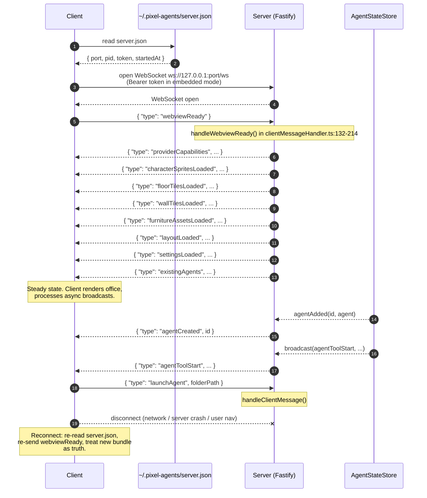

# Connection lifecycle

A Pixel Agents client connection has six phases: **discover, connect, ready, bundle, steady-state, disconnect**. This page walks through each one, defines the resync contract, and tells you how to handle a server that restarts mid-session.

If you have not read [discovery and auth](./discovery-and-auth) yet, do that first. This page assumes you can already find the server and present a Bearer token if needed.

## The full handshake



## Phase 1 - Discover

The client reads `~/.pixel-agents/server.json`, parses it as a `ServerConfig` (`server/src/server.ts:14-23`), and verifies the PID is alive. Full details in [discovery and auth](./discovery-and-auth).

The important property: this read happens **on every connect attempt**, including reconnects. The port can change after a restart. The token always changes after a restart (it is regenerated via `crypto.randomUUID()` at `server/src/server.ts:78`). Caching the values from a previous connection is wrong.

## Phase 2 - Connect

Open a WebSocket to `ws://127.0.0.1:<port>/ws`.

- Embedded mode (VS Code): include `Authorization: Bearer <token>`.
- Standalone mode (CLI): the header is harmless if present and unnecessary if absent.

The server's WebSocket route (`server/src/httpServer.ts:134-148`):

```ts
app.get('/ws', { websocket: true }, (socket, request) => {
  // In standalone mode (not embedded), skip auth for WebSocket connections.
  // The server binds to 127.0.0.1, so only local clients can connect.
  // In embedded mode (VS Code), require Bearer token for security.
  if (options.embedded) {
    const auth = request.headers.authorization ?? '';
    const expected = `Bearer ${options.token}`;
    const authBuf = Buffer.from(auth);
    const expectedBuf = Buffer.from(expected);
    if (authBuf.length !== expectedBuf.length || !crypto.timingSafeEqual(authBuf, expectedBuf)) {
      socket.close(4001, 'unauthorized');
      return;
    }
  }
```

On success, the WebSocket transitions to `OPEN` and the server starts forwarding events from the `AgentStateStore` (`server/src/httpServer.ts:150-202`). Note that broadcasts from the store before you send `webviewReady` will still arrive at your socket - the listeners are attached on connect. The intended pattern is to send `webviewReady` immediately on `onopen` so you get the initial bundle before any stray broadcasts confuse your handler.

## Phase 3 - Send `webviewReady`

Send `{ "type": "webviewReady" }`. This is a single-shot message; you should send it exactly once per connection (and again after each reconnect).

The server reacts in `handleWebviewReady` (`server/src/clientMessageHandler.ts:132-214`). Skimming the body in order:

```ts
function handleWebviewReady(send: WsSend, ctx: ClientMessageContext): void {
  const { store, runtime, cache } = ctx;
  const adapter = store.getAdapter();

  // 1. Provider capabilities (must arrive before any agent messages)
  send({
    type: 'providerCapabilities',
    readingTools: [...claudeProvider.readingTools],
    subagentToolNames: [...claudeProvider.subagentToolNames],
  });

  // 2. Assets (from server cache, loaded at startup via pngjs)
  if (cache) {
    if (cache.characters) {
      send({ type: 'characterSpritesLoaded', characters: cache.characters.characters });
    }
    if (cache.floorTiles) {
      send({ type: 'floorTilesLoaded', sprites: cache.floorTiles });
    }
    if (cache.wallTiles) {
      send({ type: 'wallTilesLoaded', sets: cache.wallTiles });
    }
    if (cache.furniture) {
      send({
        type: 'furnitureAssetsLoaded',
        catalog: cache.furniture.catalog,
        sprites: Object.fromEntries(cache.furniture.sprites),
      });
    }
  }

  // 3. Layout (saved file, or bundled default)
  const savedLayout = readLayoutFromFile();
  send({ type: 'layoutLoaded', layout: savedLayout ?? cache?.defaultLayout ?? null });
```

The handler then sends `settingsLoaded` and finally `existingAgents` (lines 168-213).

## Phase 4 - Receive the bundle

The bundle arrives in canonical order. The client must wait for the **whole** bundle before it can render the office because later messages reference earlier ones (the layout references furniture IDs; the existing agents reference seat IDs that depend on the layout).

| Order | Message | Purpose |
| --- | --- | --- |
| 1 | `providerCapabilities` | Which tools render as "reading" vs "typing" and which spawn sub-agents. Without this, your renderer cannot pick the right animation. |
| 2 | `characterSpritesLoaded` | Six pre-colored character sprite sets. |
| 3 | `floorTilesLoaded` | Seven floor patterns. |
| 4 | `wallTilesLoaded` | Wall auto-tile bitmask pieces. |
| 5 | `furnitureAssetsLoaded` | Catalog (array) plus sprite map (id → `SpriteData`). |
| 6 | `layoutLoaded` | The office tiles + furniture instances. |
| 7 | `settingsLoaded` | Persisted user toggles (sound, labels, hooks, etc.). |
| 8 | `existingAgents` | IDs, seat assignments, folder names, external flags. |

After `existingAgents` arrives, the client is in steady state.

The four asset messages are the heavy ones. See [handling assets](./handling-assets) for shape details and caching strategies.

## Phase 5 - Steady state

The server pushes broadcasts as they happen. The client sends commands as the user interacts. Neither side acknowledges the other; the protocol is fire-and-forget on both directions.

Typical broadcasts you will see:

- `agentCreated` / `agentClosed` - agent lifecycle
- `agentSelected` - terminal focus changed (VS Code)
- `agentStatus` - `'active'` or `'waiting'`
- `agentToolStart` / `agentToolDone` / `agentToolsClear` - tool activity
- `agentToolPermission` / `agentToolPermissionClear` - permission prompts
- `subagentToolStart` / `subagentToolDone` / `subagentClear` / `subagentToolPermission` - sub-agents (negative IDs)
- `agentTeamInfo` - team membership for the agent
- `agentTokenUsage` - running token counters
- `agentDiagnostics` - debug snapshot (response to `requestDiagnostics`)
- `externalAssetDirectoriesUpdated` - config changed
- `workspaceFolders` - VS Code multi-root info

Schemas at `core/src/messages.ts:58-264`.

Typical commands you will send:

- `launchAgent` - start a new agent (`{ type: 'launchAgent', folderPath?, bypassPermissions? }`)
- `focusAgent` / `closeAgent` - terminal interaction (VS Code)
- `saveLayout` / `saveAgentSeats` - persist editor changes
- `setSoundEnabled` / `setAlwaysShowLabels` / `setHooksEnabled` / etc. - settings
- `exportLayout` / `importLayout` - file dialog requests (VS Code)
- `requestDiagnostics` - ask for an `agentDiagnostics` snapshot

Schemas at `core/src/messages.ts:266-354`.

## Phase 6 - Disconnect

Disconnects happen for three reasons:

1. **Client navigates away or shuts down.** The client closes the socket gracefully (code 1000).
2. **Network failure or transient error.** The socket emits `close` with no clean code, or `error`.
3. **Server stop / crash.** The socket closes; the next connect attempt will see either an updated `server.json` (if the server restarted) or a missing file (if it is still down).

The server's cleanup on disconnect (`server/src/httpServer.ts:197-201`):

```ts
socket.on('close', () => {
  store.off('agentAdded', onAgentAdded);
  store.off('agentRemoved', onAgentRemoved);
  store.off('broadcast', onBroadcast);
});
```

The listeners are removed from the store, but the **store state itself does not change**. Agents continue to exist. Tool activity keeps running. Everything that was true before the disconnect remains true after it.

## Resync rules

**There is no message replay buffer.** The server does not remember which broadcasts it sent you. When you reconnect, you have to re-discover the world from scratch.

### On every reconnect

1. Re-read `server.json`. The port and token may have changed.
2. Open a fresh WebSocket.
3. Send `webviewReady` again.
4. Treat the new `existingAgents` as truth. Discard your prior list.
5. Treat the new `layoutLoaded` as truth. Discard your prior layout.
6. Subsequent broadcasts pick up from "now."

### What about in-flight tool state?

For agents that exist now, there is no separate "current tool state" message. The server's `existingAgents` includes IDs but not their current tool details. The client cannot recover the exact tool activity that was happening at disconnect time.

In practice this is acceptable: any **new** tool activity arrives via `agentToolStart` after reconnect, and any `agentToolsClear` (turn end) zeroes the slate. If you reconnect mid-tool, your UI may show no active tool for a few moments until the next event arrives. That is the protocol's resync contract.

### Caches and reconnects

Asset caches (sprites, layout, settings) **can** be reused if you remember them, but the simplest correct strategy is to discard them on disconnect and accept a re-load. The server resends them on every `webviewReady`. The cost is bandwidth (the sprites are a few MB total over the wire). The benefit is no stale-cache bugs.

If you want a faster reconnect, you can hash the bundle on receive and skip processing the parts that match a cached hash. The protocol does not provide hashes for you; you would compute them yourself.

## Reconnect backoff

When a disconnect happens, do not reconnect immediately in a tight loop. Use **exponential backoff with jitter**, capped at around 30 seconds. A reasonable implementation:

```ts
let attempts = 0;
async function reconnect(): Promise<void> {
  while (true) {
    try {
      const cfg = loadServerConfig(); // fresh read every time
      const ws = await openWebSocket(cfg);
      attempts = 0;
      return wireUp(ws);
    } catch (err) {
      attempts++;
      const base = Math.min(30000, 500 * Math.pow(2, attempts));
      const jitter = Math.random() * 1000;
      await sleep(base + jitter);
    }
  }
}
```

A few rules of thumb:

- **Always start with a fresh `loadServerConfig()`.** This is the most common cause of failed reconnects: the client uses the old port and the new server is on a different one.
- **Treat "server.json missing" differently from "WebSocket failed."** The first means the server is down; backoff is still appropriate, but a user notification is also reasonable. The second means the server is up but you cannot connect; backoff alone is fine.
- **Cap the delay.** Thirty seconds is plenty. The user wants to see results when they relaunch the server.

## When the server restarts

A restart cycle looks like this from the client's perspective:

1. WebSocket closes (no clean code, or close code 1006).
2. The client's reconnect loop kicks in. First attempt: `server.json` may still hold the **old** PID+port for a brief window before the new server overwrites it.
3. Liveness check on the old PID fails (`process.kill(pid, 0)` throws).
4. Backoff one tick. Try again.
5. `server.json` now holds the new PID, new port, new token. Liveness check passes.
6. Connect, send `webviewReady`, receive the fresh bundle.

If the new server happened to start on the same port (likely, since standalone always tries port 3100 first), your client never sees the port change. But the token will always be different. Your reconnect must read it from the file rather than assume.

## What happens on a server crash

`PixelAgentsServer.stop()` deletes `server.json` only if the PID inside matches the current process (`server/src/server.ts:158-170`). A crash bypasses `stop()`, so the file stays put. The next started server detects the stale PID via `isProcessRunning` (`server/src/server.ts:67-75`) and overwrites the file.

From the client's perspective: WebSocket closes, `server.json` still exists but its PID is dead, you keep backing off until either a new server writes a fresh file or the user gives up. Your reconnect loop handles this correctly because each iteration reads the file and runs the liveness check.

## A note on multi-window

In embedded mode (VS Code), the second window detects the existing server via `server.json` and reuses it without writing a new one. So both windows share a single server, single port, single token. From a client perspective this changes nothing - you read `server.json` and connect just the same. The shared server multiplexes broadcasts and store events across all windows that have opened a WebSocket on it.

## Cross-references

- [Discovery and auth](./discovery-and-auth) - what goes into the connect step.
- [Handling assets](./handling-assets) - what to do with the bundle once it arrives.
- [Server messages reference](/reference/protocol/server-messages) - every broadcast variant.
- [Client messages reference](/reference/protocol/server-messages) - every command variant.
- [Errors reference](/reference/errors) - close codes, HTTP status codes, recovery actions.
- [Clients overview](./overview) - the layer above this one.
