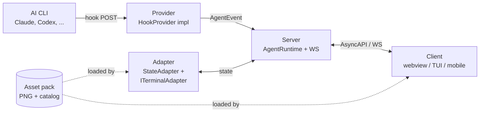

# Build on Pixel Agents

:::warning[AI-generated docs]
This document was AI-generated and may have some mistakes - we apologize for this, we're in the process of reviewing all documents. If you find any issues, we'd be thankful if you [submit an edit PR](https://github.com/pixel-agents-hq/docs/edit/main/docs/build/index.md).
:::

Pixel Agents has four extension surfaces. Pick the one matching your goal, then follow that surface's guide top to bottom.

You are looking at the **build** section, which is for developers extending the platform. If you want to install Pixel Agents and use it as-is, see the [Use guides](/use/standalone/overview) instead. If you want background on how the platform is wired, see [Architecture](/learn/architecture).

## The four extension surfaces

| Surface | Purpose | What you implement | Where it lives |
|---|---|---|---|
| **Provider** | Add a new AI CLI (Claude, Copilot, Codex, Cursor agent) | `HookProvider` interface from `core/src/provider.ts` | `server/src/providers/hook/<cli>/` |
| **Client** | Render the office in a new UI (alt webview, mobile, terminal TUI) | A consumer of the AsyncAPI protocol over the WebSocket | Anywhere; talks to `ws://127.0.0.1:<port>/ws` |
| **Adapter** | Host the runtime in a new IDE (JetBrains, Zed, custom Electron shell) | `StateAdapter` plus `ITerminalAdapter` | A new package alongside `adapters/` |
| **Asset pack** | Distribute custom furniture, characters, tilesets | PNGs plus per-item `manifest.json` files | A directory the user adds via Settings |

Each surface is independent. You can add a Codex provider without touching the webview, ship a mobile client without changing any provider, and drop in a tileset without writing any TypeScript.

## How the surfaces relate

The **provider** turns raw CLI events into the shared `AgentEvent` shape. The **server** routes those events through `AgentRuntime`, keeps the canonical state, and broadcasts protocol messages over WebSocket. An **adapter** lets a host (VS Code, a CLI binary, a future JetBrains plugin) own terminal lifecycle and state storage. A **client** subscribes to the protocol and draws the office. An **asset pack** is pure data, the client and adapter consume it without any interface contract.

## The four packages

Code today is split across four package roots, with the registry files you will edit listed.

- `core/` shared types and interfaces. The provider contract lives in `core/src/provider.ts:60-128`, the team contract in `core/src/teamProvider.ts:13-66`. Adding a new event kind or provider field bumps protocol versions here.
- `server/` standalone Node server plus the provider registry. Add a provider directory under `server/src/providers/hook/<cli>/` and export it from `server/src/providers/index.ts`.
- `adapters/` host adapters. Today this holds the VS Code adapter and the file-based standalone adapter. A new host (JetBrains, Zed) lands here as a sibling package.
- `webview-ui/` the React canvas client. Subscribes to the protocol and renders the office. Asset rendering, FSM, and pathfinding live here.

## Pick your starting page

- Adding a CLI? Read [Providers overview](/build/providers/overview), then [Adding a provider](/build/providers/adding-a-provider).
- Adding a UI? Read the [Clients section](/build/clients/overview) once it lands. A client speaks the AsyncAPI protocol, see [Protocol reference](/reference/protocol/overview) for the message catalog.
- Adding an IDE host? Read the [Adapters section](/build/adapters/overview) once it lands. An adapter implements `StateAdapter` (see [State management](/reference/state-management)) plus the terminal interface.
- Shipping a tileset? Read the [Asset pack section](/build/assets/overview). You will produce per-item folders under `furniture/`, each with a `manifest.json` plus the referenced PNGs.

## Cross-surface contracts you should know

Whether you write a provider, client, or adapter, three contracts are load-bearing.

**AgentEvent** at `core/src/provider.ts:14-56` is the normalized event shape every provider emits. Adding fields to it is a breaking change. Providers and the handler refuse to dispatch when their declared `protocolVersion` does not match, see `server/src/hookEventHandler.ts:62, 72-78`.

**StateAdapter** is the interface every host implements to persist agent metadata, seats, and external asset directories. See [State management](/reference/state-management) for the full picture.

**Protocol** is the WebSocket message catalog between server and client. See [Protocol](/learn/protocol) for the overview and [Protocol reference](/reference/protocol/overview) for the message-by-message details.

## Read next

- [Providers overview](/build/providers/overview) what a provider is and how it fits.
- [Architecture](/learn/architecture) the runtime, the layers, the data flow.
- [State management](/reference/state-management) what an adapter is responsible for.
