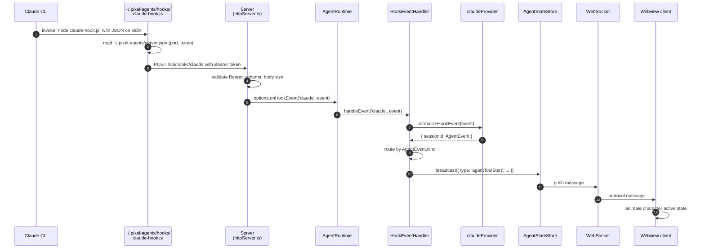

# Reference implementation: Claude Code

Reading the Claude provider end to end is the fastest path to understanding the contract. This page walks through every Claude file in reading order with line citations. When you build your own provider, return here and use Claude as the structural template.

The interface itself is at `core/src/provider.ts:60-128`. Conceptual background is in [Providers overview](/build/providers/overview). The step-by-step build guide is in [Adding a provider](/build/providers/adding-a-provider).

## Source layout

Five files plus one directory:

```
server/src/providers/hook/claude/
  claude.ts                 # the HookProvider object + formatToolStatus + normalizeHookEvent
  claudeTeamProvider.ts     # optional TeamProvider implementation
  claudeHookInstaller.ts    # writes ~/.claude/settings.json
  constants.ts              # CLAUDE_HOOK_SCRIPT_NAME, CLAUDE_HOOK_EVENTS, CLAUDE_TERMINAL_NAME_PREFIX
  hooks/
    claude-hook.ts          # the script that runs INSIDE Claude, POSTs to our server
```

Bundling output:

```
dist/hooks/claude-hook.js   # CJS bundle produced by esbuild buildHooks()
```

Installed-on-user-machine output:

```
~/.pixel-agents/hooks/claude-hook.js   # copied via copyHookScript(extensionPath)
~/.pixel-agents/server.json            # written by the server with port + token + pid
~/.claude/settings.json                # patched with hook entries
```

## File 1: `constants.ts`

The smallest file, read first to see what symbols the rest reference (`server/src/providers/hook/claude/constants.ts:1-35`):

```ts
export const CLAUDE_HOOK_SCRIPT_NAME = 'claude-hook.js';

export const CLAUDE_HOOK_EVENTS = [
  'SessionStart',
  'SessionEnd',
  'Stop',
  'PermissionRequest',
  'Notification',
  'UserPromptSubmit',
  'PreToolUse',
  'PostToolUse',
  'PostToolUseFailure',
  'SubagentStart',
  'SubagentStop',
  'TeammateIdle',
  'TaskCreated',
  'TaskCompleted',
] as const;

export const CLAUDE_TERMINAL_NAME_PREFIX = 'Claude Code';
```

The 14-event array is the source of truth for which hooks the installer wires into `~/.claude/settings.json`. The handler does not consult this list, every hook event the user fires arrives via HTTP and gets normalized; this array is only for installation.

The terminal name prefix is used by VS Code's adapter to match terminals to agents for heuristic adoption. Other adapters may ignore it.

For the full hook coverage table see [Hooks coverage](/reference/hooks-coverage).

## File 2: `claudeHookInstaller.ts`

Writes Claude's settings file. The interesting moves:

**Atomic writes** (`server/src/providers/hook/claude/claudeHookInstaller.ts:50-65`):

```ts
function writeClaudeSettings(settings: ClaudeSettings): void {
  const settingsPath = getClaudeSettingsPath();
  const dir = path.dirname(settingsPath);
  try {
    if (!fs.existsSync(dir)) {
      fs.mkdirSync(dir, { recursive: true });
    }
    const tmpPath = settingsPath + '.pixel-agents-tmp';
    fs.writeFileSync(tmpPath, JSON.stringify(settings, null, 2), 'utf-8');
    fs.renameSync(tmpPath, settingsPath);
  } catch (e) {
    console.error(`[Pixel Agents] Failed to write Claude settings: ${e}`);
  }
}
```

Tmp + rename means a crash during write leaves the user's settings intact. The original is replaced atomically in one syscall.

**Identifying our entries** (`server/src/providers/hook/claude/claudeHookInstaller.ts:67-75`):

```ts
const LEGACY_HOOK_MARKER = 'pixel-agents-hook.js';

function isOurHookEntry(entry: ClaudeHookEntry): boolean {
  return entry.hooks.some(
    (h) => h.command.includes(HOOK_SCRIPT_MARKER) || h.command.includes(LEGACY_HOOK_MARKER),
  );
}
```

The check looks for either the current script name or the legacy one. This is how upgrades clean up old script paths.

**Idempotent install** (`server/src/providers/hook/claude/claudeHookInstaller.ts:113-140`):

```ts
export function installHooks(): void {
  const settings = readClaudeSettings();
  if (!settings.hooks) {
    settings.hooks = {};
  }

  const events = CLAUDE_HOOK_EVENTS;
  let changed = false;

  for (const event of events) {
    if (!Array.isArray(settings.hooks[event])) {
      settings.hooks[event] = [];
    }
    const entries = settings.hooks[event];
    const filtered = entries.filter((e) => !isOurHookEntry(e));
    filtered.push(makeHookEntry());
    if (JSON.stringify(filtered) !== JSON.stringify(entries)) {
      settings.hooks[event] = filtered;
      changed = true;
    }
  }
  if (changed) writeClaudeSettings(settings);
}
```

Install removes any existing Pixel Agents entries, then adds fresh ones. Running install twice produces the same result as running it once.

**Uninstall preserves user entries** (`server/src/providers/hook/claude/claudeHookInstaller.ts:143-168`):

```ts
export function uninstallHooks(): void {
  const settings = readClaudeSettings();
  if (!settings.hooks) return;

  let changed = false;
  for (const event of Object.keys(settings.hooks)) {
    const entries = settings.hooks[event];
    if (!Array.isArray(entries)) continue;
    const filtered = entries.filter((e) => !isOurHookEntry(e));
    if (filtered.length !== entries.length) {
      settings.hooks[event] = filtered;
      changed = true;
    }
    if (settings.hooks[event].length === 0) {
      delete settings.hooks[event];
    }
  }
  if (Object.keys(settings.hooks).length === 0) {
    delete settings.hooks;
  }
  if (changed) writeClaudeSettings(settings);
}
```

Other tools' hook entries are left alone. Empty objects are cleaned up. The `hooks` key itself is removed if no events remain.

**Copy the hook script** (`server/src/providers/hook/claude/claudeHookInstaller.ts:171-190`):

```ts
export function copyHookScript(extensionPath: string): void {
  const src = path.join(extensionPath, 'dist', 'hooks', CLAUDE_HOOK_SCRIPT_NAME);
  const dst = getHookScriptPath();
  const dstDir = path.dirname(dst);

  try {
    if (!fs.existsSync(dstDir)) {
      fs.mkdirSync(dstDir, { recursive: true, mode: 0o700 });
    }
    fs.copyFileSync(src, dst);
    fs.chmodSync(dst, 0o700);
  } catch (e) {
    console.error(`[Pixel Agents] Failed to copy hook script: ${e}`);
  }
}
```

The destination is `~/.pixel-agents/hooks/claude-hook.js`, mode `0700` (owner read / write / execute only). Other adapters call `copyHookScript(extensionPath)` once at startup.

## File 3: `hooks/claude-hook.ts`

The script that runs inside Claude. Bundled by esbuild into `dist/hooks/claude-hook.js`, copied to `~/.pixel-agents/hooks/claude-hook.js`, executed by Claude via `node "<path>"`.

Full source (it is short):

```ts
import * as fs from 'fs';
import * as http from 'http';
import * as os from 'os';
import * as path from 'path';

import { HOOK_API_PREFIX, SERVER_JSON_DIR, SERVER_JSON_NAME } from '../../../../constants.js';
import type { ServerConfig } from '../../../../server.js';

const SERVER_JSON = path.join(os.homedir(), SERVER_JSON_DIR, SERVER_JSON_NAME);

async function main(): Promise<void> {
  let input = '';
  for await (const chunk of process.stdin) input += chunk;

  let data: Record<string, unknown>;
  try {
    data = JSON.parse(input);
  } catch {
    process.exit(0);
  }

  let server: ServerConfig;
  try {
    server = JSON.parse(fs.readFileSync(SERVER_JSON, 'utf-8'));
  } catch {
    process.exit(0);
  }

  const body = JSON.stringify(data);
  return new Promise((resolve) => {
    const req = http.request(
      {
        hostname: '127.0.0.1',
        port: server.port,
        path: `${HOOK_API_PREFIX}/claude`,
        method: 'POST',
        headers: {
          'Content-Type': 'application/json',
          'Content-Length': Buffer.byteLength(body),
          Authorization: `Bearer ${server.token}`,
        },
        timeout: 2000,
      },
      () => resolve(),
    );
    req.on('error', () => resolve());
    req.on('timeout', () => {
      req.destroy();
      resolve();
    });
    req.end(body);
  });
}

main()
  .catch(() => {})
  .finally(() => process.exit(0));
```

Five things to notice:

- **No external dependencies.** Only `fs`, `http`, `os`, `path`. The script is a CJS bundle that runs from anywhere on the user's machine.
- **Two graceful exits.** Malformed stdin: `exit(0)`. Missing or malformed `server.json`: `exit(0)`. The script never throws into Claude's session.
- **Loopback only.** `hostname: '127.0.0.1'`. The server binds to localhost only.
- **2-second timeout, hard.** Claude is blocking on this hook. Slow networks must not freeze the user's editor.
- **Bearer token from `server.json`.** The token rotates per server start. The script does not cache it.

## File 4: `claude.ts`

The provider object itself. Read in the order the file is laid out: helpers first, then the provider export.

**`formatToolStatus`** (`server/src/providers/hook/claude/claude.ts:21-67`). One switch arm per tool. Read paths basename-truncate, Bash commands and Task descriptions get character limits from `BASH_COMMAND_DISPLAY_MAX_LENGTH` and `TASK_DESCRIPTION_DISPLAY_MAX_LENGTH`. The default arm returns `Using ${toolName}` so a new Claude tool still produces something readable.

**`getSessionDirs`** (`server/src/providers/hook/claude/claude.ts:71-94`). Maps a workspace path to Claude's transcript directory. Falls back to a case-insensitive readdir scan on Windows because drive letter casing can differ between VS Code and Claude. Returns the expected path even if missing, the caller tolerates non-existent directories.

**`buildLaunchCommand`** (`server/src/providers/hook/claude/claude.ts:96-104`):

```ts
function buildLaunchCommand(
  sessionId: string,
  cwd: string,
  opts?: { bypassPermissions?: boolean },
): { command: string; args: string[]; env?: Record<string, string> } {
  const args = ['--session-id', sessionId];
  if (opts?.bypassPermissions) args.push('--dangerously-skip-permissions');
  return { command: 'claude', args, env: { PWD: cwd } };
}
```

This is what +Agent buttons in the office produce a terminal for. The session id is the bridge between the terminal and the JSONL transcript watcher.

**`getAllSessionRoots`** (`server/src/providers/hook/claude/claude.ts:106-110`). Returns `[~/.claude/projects]`. Used by the global session scanner ("Watch All Sessions").

**`normalizeHookEvent`** (`server/src/providers/hook/claude/claude.ts:123-235`). The translator. The comment above it states the invariant clearly:

```ts
// All raw Claude hook payload fields (tool_name, tool_input, agent_type, etc.) are
// read HERE and HERE ONLY. Downstream (hookEventHandler.ts) sees only the normalized
// AgentEvent union.
```

The switch covers fourteen cases mapping to AgentEvent kinds:

| Raw Claude event | Normalized AgentEvent.kind | Notes |
|---|---|---|
| `PreToolUse` | `toolStart` | Synthetic `hook-<ts>` toolId, real id arrives later via JSONL |
| `PostToolUse` | `toolEnd` (toolId: `'current'`) | Sentinel; handler correlates by `currentHookToolId` |
| `PostToolUseFailure` | `toolEnd` (toolId: `'current'`) | Same behavior as PostToolUse |
| `Stop` | `turnEnd` | |
| `UserPromptSubmit` | `null` (dropped) | No AgentEvent kind yet |
| `SubagentStart` | `subagentStart` | Carries `agent_type` for team routing |
| `SubagentStop` | `subagentEnd` (toolId: `'current'`) | |
| `PermissionRequest` | `permissionRequest` | |
| `Notification(permission_prompt)` | `permissionRequest` | Collapses two events to one kind |
| `Notification(idle_prompt)` | `turnEnd` | Collapses to Stop semantics |
| `SessionStart` | `sessionStart` | Carries `source`, `transcript_path`, `cwd` |
| `SessionEnd` | `sessionEnd` | Carries `reason` (`clear`, `resume`, `exit`, ...) |
| `TeammateIdle` | `subagentTurnEnd` (reason: `'idle'`) | Team-routed |
| `TaskCompleted` | `subagentTurnEnd` (reason: `'completed'`) | Team-routed |
| `TaskCreated` | `null` (dropped) | Informational only |
| anything else | `null` | Forward compatibility |

The `toolId: 'current'` sentinel and the synthetic `hook-<ts>` ids are not laziness, they are deliberate. The PostToolUse hook does not echo back the tool's id, the handler stores `currentHookToolId` on the agent at PreToolUse and correlates on PostToolUse (`server/src/hookEventHandler.ts:400-406, 446-457`).

**The provider export** (`server/src/providers/hook/claude/claude.ts:255-279`):

```ts
export const claudeProvider: HookProvider = {
  kind: 'hook',
  id: 'claude',
  displayName: 'Claude Code',
  protocolVersion: 1,

  normalizeHookEvent,

  installHooks,
  uninstallHooks,
  areHooksInstalled,

  formatToolStatus,
  permissionExemptTools: new Set(['Task', 'Agent', 'AskUserQuestion']),
  subagentToolNames: new Set(['Task', 'Agent']),
  readingTools: new Set(['Read', 'Grep', 'Glob', 'WebFetch', 'WebSearch']),
  terminalNamePrefix: CLAUDE_TERMINAL_NAME_PREFIX,

  getSessionDirs,
  getAllSessionRoots,
  sessionFilePattern: '*.jsonl',
  buildLaunchCommand,

  team: claudeTeamProvider,
};
```

This is the entire shape of a HookProvider. Every member maps to a section of the interface at `core/src/provider.ts:60-128`.

## File 5: `claudeTeamProvider.ts`

Optional. Implements `TeamProvider` from `core/src/teamProvider.ts:13-66`. Full walkthrough in [TeamProvider extension](/build/providers/teamprovider-extension), the file itself is 135 lines and worth reading top to bottom. Key moves:

- **Sidecar metadata** at `<teammate>.meta.json` next to each teammate JSONL.
- **Teammate directory** at `<projectDir>/<leadSessionId>/subagents/`.
- **Team config** at `~/.claude/teams/<teamName>/config.json`, polled to detect membership changes.
- **`isTeammateSpawnCall`** returns true only when `toolName === 'Agent' && toolInput.run_in_background === true`. Without that flag, `Agent` is a basic within-turn subagent.

A provider without team support simply omits `team:` from the provider object. None of the team-gated branches in `HookEventHandler` run (`server/src/hookEventHandler.ts:319, 333, 485`).

## End-to-end data flow

Below is the path a single `PreToolUse` hook event takes from the user's CLI to the office canvas.



Numbered key citations:

1. The CLI invocation comes from `~/.claude/settings.json`, written by `installHooks()` at `server/src/providers/hook/claude/claudeHookInstaller.ts:113-140`.
2. The discovery file is read at `server/src/providers/hook/claude/hooks/claude-hook.ts` lines 9 and 21-26.
3. The POST path is `${HOOK_API_PREFIX}/claude` at `server/src/providers/hook/claude/hooks/claude-hook.ts:35`.
4. The route validates Bearer plus body size at `server/src/httpServer.ts:101-130`. The `onHookEvent` callback fires at line 124.
5. The CLI wires `options.onHookEvent` to `runtime.handleHookEvent` at `server/src/cli.ts:93-95`.
6. `AgentRuntime.handleHookEvent` forwards to the handler at `server/src/agentRuntime.ts:187-189`:
   ```ts
   handleHookEvent(providerId: string, event: Record<string, unknown>): void {
     this.hookEventHandler.handleEvent(providerId, event as HookEvent);
   }
   ```
7. The handler reads `provider.normalizeHookEvent` at `server/src/hookEventHandler.ts:141`. Everything downstream uses only `normEvent.kind`.
8. Dispatch by kind starts at `server/src/hookEventHandler.ts:308`. For `toolStart` it routes to `handlePreToolUse` at line 311.
9. The broadcast happens at `server/src/hookEventHandler.ts:425-437`.
10. The WS push and client render are out of scope for this page, see [Protocol](/learn/protocol) and [Architecture](/learn/architecture).

## Why this layout

Each file has exactly one responsibility:

- `constants.ts` declares CLI-specific names.
- `claudeHookInstaller.ts` is the only place that touches `~/.claude/settings.json`.
- `claude-hook.ts` is the only piece that runs inside the CLI.
- `claude.ts` is the only place that reads raw Claude fields.
- `claudeTeamProvider.ts` is the only place that knows about teammate sidecar files and team configs.

A new provider produces the same five-file shape with different contents. If you find your provider growing files outside this set, that is a smell, you are leaking knowledge across boundaries.

## Cross references

- Interface: [HookProvider reference](/reference/hookprovider).
- Team interface: [TeamProvider reference](/reference/teamprovider).
- Build guide: [Adding a provider](/build/providers/adding-a-provider).
- Full hook event coverage table: [Hooks coverage](/reference/hooks-coverage).
- Where this fits in the system: [Architecture](/learn/architecture).
- Hooks vs heuristic mode tradeoffs: [Hooks vs heuristic](/learn/hooks-vs-heuristic).
