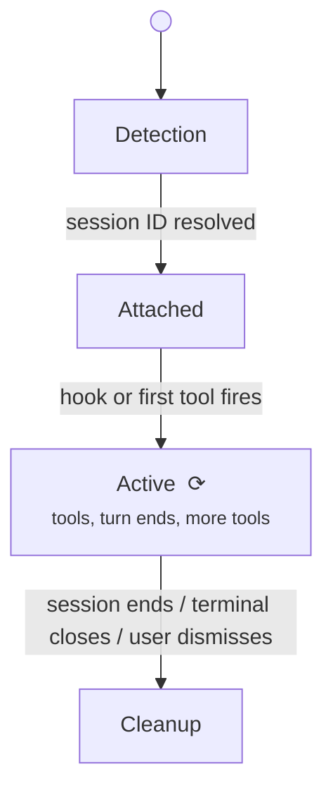
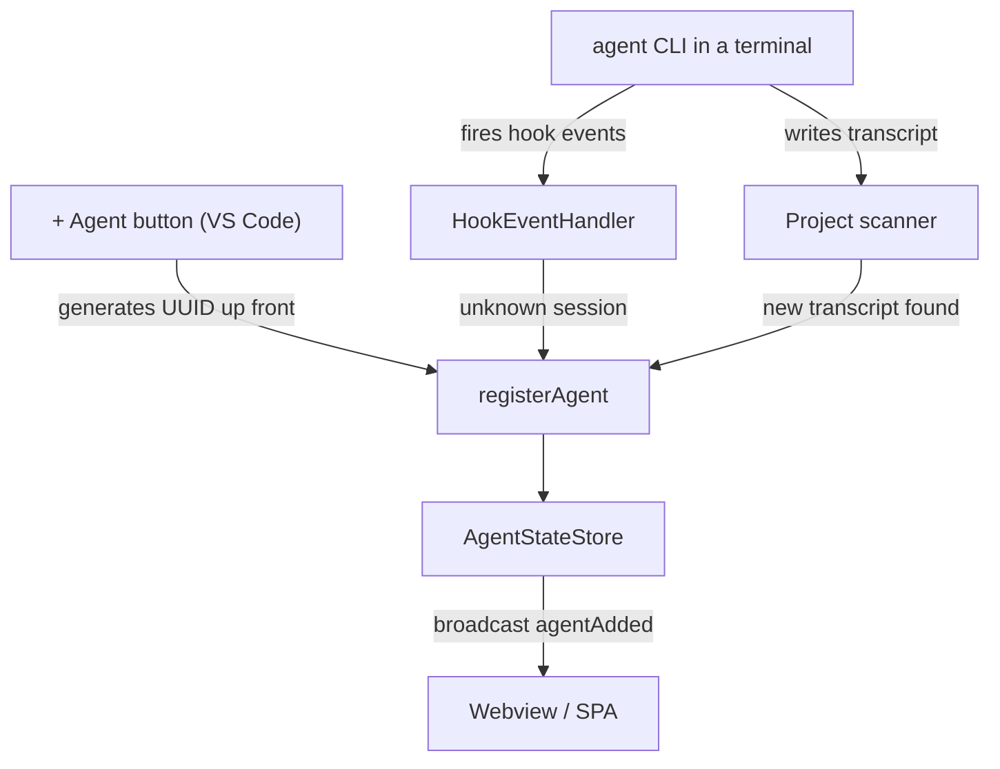

# Agent lifecycle

The journey of a single agent from "doesn't exist" to "in the office" to "gone." This page walks through the states and transitions; for the conceptual primitives, see [Concepts](./concepts).

## The four phases

Four phases: **Detection** → **Attached** → **Active** → **Cleanup**. Each has a different code path and a different failure mode.

Where the signals come from, at a glance:

## Phase 1: Detection

An agent is detected by one of three paths. For a session you start yourself, paths A and B race - whichever signal lands first registers the agent.

### Path A: The agent announces itself (hooks)

When hooks are installed (the default) and a session fires its first hook event:

1. The hook script POSTs the payload to the server.
2. The active provider normalizes it into an `AgentEvent`.
3. The `HookEventHandler` looks up the session ID in its router (`SessionRouter`).
4. If known, dispatch immediately.
5. If unknown, buffer the event (up to `HOOK_EVENT_BUFFER_MS = 5_000ms`) and trigger external-session adoption via the `onExternalSessionDetected` lifecycle callback.

The buffer protects against the race where a hook arrives before the agent is registered (e.g. the project scanner hasn't run yet).

### Path B: The scanner finds the transcript

You run an agent yourself in a terminal (inside or outside VS Code). The project scanner (`PROJECT_SCAN_INTERVAL_MS = 1000` from `server/src/constants.ts:4`) ticks once per second, looking at the directory where the agent CLI writes its transcripts. When a new transcript appears:

1. Check if it's already known. If yes, skip.
2. Check if it's been dismissed (closed by the user). If yes, skip.
3. Check if it matches an active terminal name. If yes, adopt as a non-external agent (`isExternal: false`).
4. Otherwise, adopt as an external agent (`isExternal: true`).

### Path C: Pixel Agents launches the agent itself (VS Code only)

You click **+ Agent**. The extension:

1. Generates a UUID.
2. Opens a `vscode.Terminal`.
3. Runs the agent CLI with that session ID (i.e. `claude --session-id <uuid>`).
4. Knows the session ID up front, so it goes straight to phase 2 without scanning.

This is the fastest path. The agent is registered before the CLI even writes the first transcript line.

## Phase 2: Attachment

Once detected, the agent is attached to the runtime:

1. Get the next available ID from `AgentStateStore.nextAgentId` (or use the persisted ID if restoring).
2. Construct an `AgentState`: session ID, transcript path, project directory, empty tool maps, `hookDelivered: false`, etc.
3. Insert into `AgentStateStore` (fires `agentAdded`).
4. Open a file watcher on the transcript, plus a 500ms polling timer as a watcher fallback.
5. Register the session→agent mapping with `SessionRouter` so future hook events dispatch correctly.
6. Persist via `AgentStateStore.persist()` to the state file.

The character appears in the office at this point, waiting at its assigned seat.

## Phase 3: Active

The bulk of the agent's life. State transitions happen on every tool, every turn, every permission prompt.

Everything in this phase has two sources: **hooks** (the default - instant, structured events) and the **heuristic fallback** (transcript polling plus timers, for agents whose hooks aren't delivering). The first hook that arrives sets `agent.hookDelivered = true`, which suppresses the heuristic timers from that point on. Transcript polling itself keeps running even in hook mode - its parsed events are mostly ignored while hooks deliver, but it still serves as the discovery source for inline teammates.

### Tool start

With hooks: the provider normalizes the CLI's pre-tool event (`PreToolUse`) into `toolStart`. In fallback mode, the same event is parsed out of the transcript with up to ~500ms delay.

1. Add `toolId` to `agent.activeToolIds`.
2. Set `agent.activeToolStatuses[toolId]` to the formatted status string.
3. Set `agent.activeToolNames[toolId]` to the raw tool name.
4. If the tool is in `provider.subagentToolNames`, set up sub-agent tracking.
5. Cancel any pending permission timer (we have signal now).
6. Broadcast `agentToolStart`. The webview shifts the character to the appropriate animation.

### Tool end

The mirror image (`PostToolUse` hook, or the tool result appearing in the transcript):

1. Remove `toolId` from `agent.activeToolIds`.
2. Clear the related maps.
3. Broadcast `agentToolDone` (delayed by `TOOL_DONE_DELAY_MS = 300ms` to prevent React batching from hiding brief tools).

The character's animation depends on remaining tools. If none remain and the turn isn't ended yet, the character returns to typing the "next thing."

### Permission prompt

With hooks: a permission event (`PermissionRequest` or `Notification(permission_prompt)`) arrives instantly. Heuristic fallback: a timer fires 7 seconds after a non-exempt tool starts with no signal since.

1. Set `agent.permissionSent = true`.
2. Broadcast `agentToolPermission`.
3. The character shows the "..." permission bubble (and the permission sound plays) until the prompt is resolved.

For sub-agents, permission handling is more involved: the parent's `activeSubagentToolNames` map is consulted to figure out which sub-agents are also stuck, and `subagentToolPermission` is broadcast for each.

### Waiting for input

Sometimes an agent is waiting for you mid-turn (a question, a prompt) rather than done.

With hooks: a waiting notification (`Notification(waiting_for_input)` / `idle_prompt`) fires the broadcast directly. Heuristic fallback: if no signal arrives for `TEXT_IDLE_DELAY_MS = 5000ms` after the last user prompt or turn end, the agent is presumed waiting.

1. Set `agent.isWaiting = true`.
2. Broadcast `agentStatus: 'waiting'`.
3. The character shows the done bubble.

### Turn end

With hooks: the CLI's turn-end event (`Stop`) arrives the moment the agent finishes. Heuristic fallback: a turn-duration record appears in the transcript.

1. Clear all foreground tool state. Background tools are preserved.
2. Mark the agent as waiting and broadcast it.
3. The character shows the done bubble (green checkmark, auto-fade 2s) and the done chime plays.

### Session clear

The user clears the session in the terminal (i.e. `/clear`). The CLI starts a new transcript.

With hooks: the session-end/session-start pair (`SessionEnd(reason=clear)` then `SessionStart(source=clear)`) arrives; the runtime sets `pendingClear` on the matching agent and reassigns it to the new transcript path. The character stays.

Heuristic fallback: the transcript stops growing for `CLEAR_IDLE_THRESHOLD_MS = 2000ms`, the runtime checks the head of the file for the clear command, and reassigns the agent to whatever new transcript the project scan finds in the same directory.

Either way, the character doesn't despawn. The user perceives a single continuous agent across the clear.

### Session resume

The user resumes an earlier session (i.e. `claude --resume <session>`, `--continue`, or the in-session `/resume` command). The transcript file is re-opened by the CLI.

With hooks: a resume event (`SessionStart(source=resume)`) arrives. The runtime clears any dismissal on the path, so the file is adoptable again.

Heuristic fallback: the seeded mtime check (`DismissalTracker.hasSeededMtime`) notices the file's mtime changed beyond the seeded value, releases it from tracking, and the project scanner re-adopts.

## Phase 4: Cleanup

Three paths into cleanup.

### Path A: You dismiss it from the office (X button)

The user selects a character and clicks its close button.

1. The webview sends `closeAgent { id }`.
2. If the agent has a terminal, the terminal is disposed - which flows into Path C below (including the teammate cascade for leads). For external agents, the runtime removes the agent directly.
3. Either way, the transcript is dismissed (`DismissalTracker.dismiss`) with a 3-minute cooldown so it isn't immediately re-adopted.

If the underlying session is still running, the cooldown prevents it from re-appearing for 3 minutes. After 3 minutes, if it's still active (within the 2-minute external-active threshold), it gets re-adopted.

### Path B: The agent announces its exit (hooks)

A session-end event (`SessionEnd(reason='exit'|'logout')`) arrives.

1. `HookEventHandler` fires the `onSessionEnd` lifecycle callback.
2. `AgentRuntime` checks if the agent is a team lead; if so, calls `removeTeammates` to cascade.
3. For external agents (no terminal binding), calls `removeAgent` directly.
4. For VS Code terminal-bound agents, the terminal is allowed to live; the agent is removed but the user can close the terminal separately.

### Path C: Its terminal is closed (VS Code only)

The VS Code terminal is closed by the user (or by VS Code on shutdown).

1. VS Code fires `onDidCloseTerminal`.
2. The extension's terminal listener looks up the agent by terminal reference.
3. If the agent is a team lead, its teammates are removed first - this cascade doesn't depend on hooks.
4. Calls `runtime.removeAgent(agentId)`.

### Removal sequence

`AgentRuntime.removeAgent(id)`:

1. Stop everything that watches the transcript: the parse-polling timer, the file watcher, and the watcher's fallback poll.
2. Cancel the waiting and permission timers.
3. Fire the adapter callback `onAgentRemoved` (VS Code uses this to dismiss transcript bookkeeping).
4. Delete from the store (fires `agentRemoved`) and persist the new agent list.

The webview receives `agentClosed`, plays the despawn effect, and removes the character.

## Stale check

A safety net for external agents whose transcript files disappear (e.g. deleted manually, or the CLI crashed and never wrote any more data).

`startStaleCheck` ticks every `EXTERNAL_STALE_CHECK_INTERVAL_MS = 30_000ms`. For each external agent, it confirms the transcript still exists. If not, it removes the agent. This is the "the file is just gone" cleanup.

## Persistence and restore

Agents persist to `~/.pixel-agents/<namespace>-state.json` on every change via `AgentStateStore.persist()`.

On startup:

- **VS Code:** the extension reads the persisted list, then for each persisted agent: 1) if the terminal still exists, rebind it; 2) if the terminal is gone but the transcript is still there, treat as external; 3) if both are gone, skip.
- **Standalone:** `runtime.restoreExternalAgents()` re-creates external agents from persistence. Only external agents are restorable (no terminal to rebind).

Restored agents skip the spawn effect (`skipSpawnEffect: true`).

## Sub-agent lifecycle

Sub-agents are a compressed case of the agent lifecycle: detect → attach → tool activity → cleanup, all within the lifetime of a parent tool call.

- **Detection:** when the parent fires `subagentStart` (via hook or transcript parse).
- **Attachment:** a negative ID is generated, the sub-agent is added to the parent's `activeSubagentToolIds` and `activeSubagentToolNames` maps, and a character spawns next to the parent.
- **Active:** the parent's tool events for the sub-agent are forwarded to the sub-agent character (`subagentToolStart`, `subagentToolDone`).
- **Cleanup:** when `subagentClear` fires (the parent's delegating tool completed) or the sub-agent stops, the character despawns.

Sub-agents are not persisted. They're ephemeral by design.

## Teammate lifecycle

Teammates are full agents (positive IDs, their own transcript, their own seat). They follow the standard four-phase lifecycle. The differences:

- **Detection:** triggered by a spawn event where `provider.team.isTeammateSpawnCall(toolName, toolInput) === true`. The teammate's transcript is found via `team.discoverTeammates(projectDir, leadSessionId)`.
- **Visual identity:** a teammate gets its own skin like any agent. The team is identified by labels instead: the lead shows **LEAD**, each teammate shows its name.
- **Cleanup:** when the lead's session ends (or its terminal closes), all its teammates are removed via `removeTeammates`. Teammates can also be removed individually when they fall out of `team.getTeamMembers()`.

## Failure modes

| Symptom | Cause |
|---|---|
| Agent appears then disappears within seconds | The transcript was mtime-old (`EXTERNAL_ACTIVE_THRESHOLD_MS = 120_000ms`). Scanner adopted it but the stale check removed it. |
| Agent never appears after the CLI starts | Scanner watches the workspace project dir. Wrong cwd, or the session's transcript lands in a different project dir. |
| Permission bubble never appears | Hooks not delivering and tool completed faster than the 7-second heuristic timer. |
| Multiple characters for one terminal | Adoption race - the project scanner adopted before the hook-mode confirmation. Rare. Restart the agent. |

## Next

- [The office](./the-office) - what the character does once it's in the office.
- [Hooks vs heuristic](./hooks-vs-heuristic) - the two detection modes in detail.
- [Agent Teams](./agent-teams) - teammate lifecycle deep dive.
- [State management reference](/reference/state-management) - the classes that implement this lifecycle.
