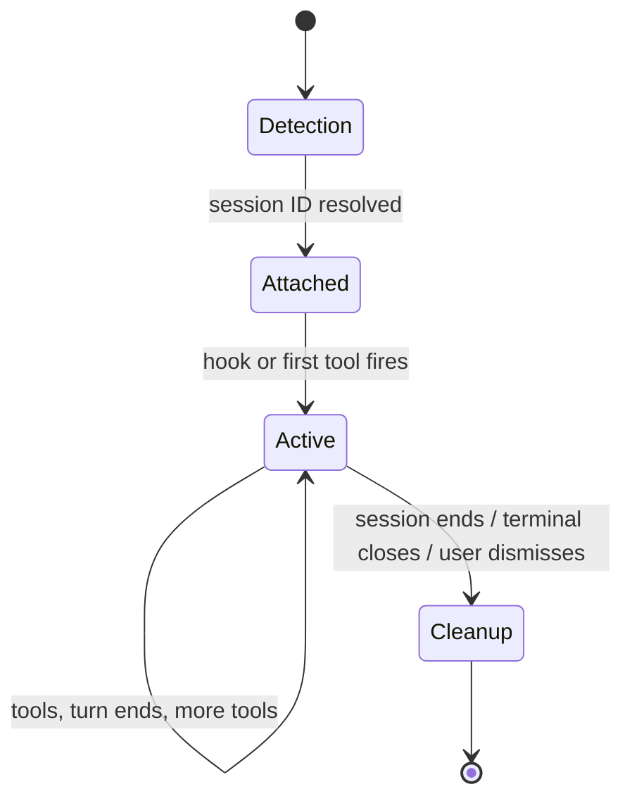
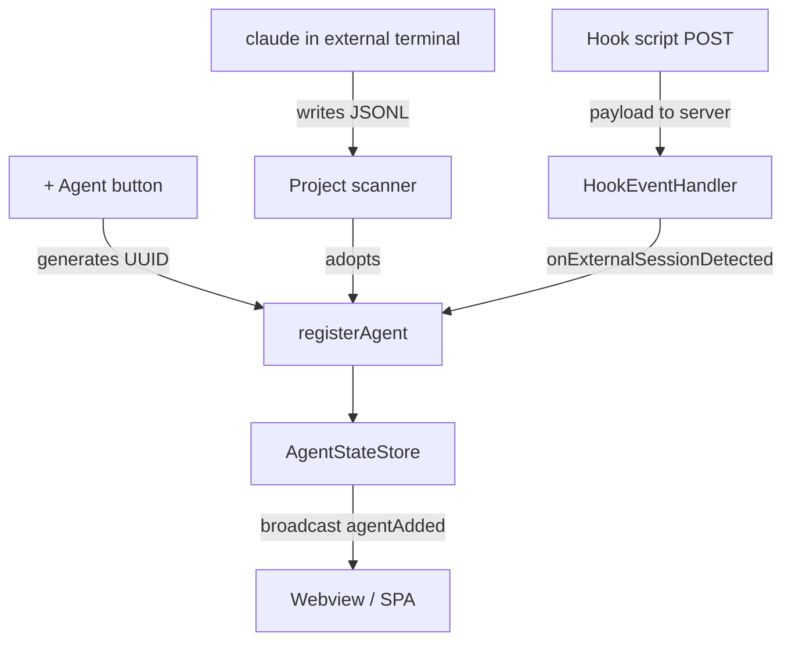

# Agent lifecycle

The journey of a single agent from "doesn't exist" to "in the office" to "gone." This page walks through the states and transitions; for the conceptual primitives, see [Concepts](./concepts).

## The four phases

Four phases: **Detection** → **Attached** → **Active** → **Cleanup**. Each has a different code path and a different failure mode.

## Phase 1: Detection

An agent is detected by one of three paths.

### Path A: Spawn from the UI (VS Code only)

You click **+ Agent**. The extension:

1. Generates a UUID.
2. Opens a `vscode.Terminal` named `claude`.
3. Runs `claude --session-id <uuid>` inside it.
4. Knows the session ID up front, so it goes straight to phase 2 without scanning.

This is the fastest path. The agent is registered before Claude even writes the first JSONL line.

### Path B: External session in workspace

You run `claude` yourself in a terminal (inside or outside VS Code). The extension's project scanner (`PROJECT_SCAN_INTERVAL_MS = 1000` from `server/src/constants.ts:4`) ticks once per second, looking at `~/.claude/projects/<workspace-hash>/`. When a new `.jsonl` file appears:

1. Check if it's already known. If yes, skip.
2. Check if it's been dismissed (closed by the user). If yes, skip.
3. Check if it matches an active terminal name. If yes, adopt as a non-external agent (`isExternal: false`).
4. Otherwise, adopt as an external agent (`isExternal: true`).

External agents have an "external" visual indicator on their character.

### Path C: Hook delivery (any mode)

When hooks are installed and a Claude session fires its first hook event:

1. The hook script POSTs to `POST /api/hooks/claude` with the payload.
2. The server normalizes via `claudeProvider.normalizeHookEvent` into an `AgentEvent`.
3. The `HookEventHandler` looks up the session ID in its router (`SessionRouter`).
4. If known, dispatch immediately.
5. If unknown, buffer the event (up to `HOOK_EVENT_BUFFER_MS = 5_000ms`) and trigger external-session adoption via the `onExternalSessionDetected` lifecycle callback.

The buffer protects against the race where a hook arrives before the agent is registered (e.g. the project scanner hasn't run yet).

## Phase 2: Attachment

Once detected, the agent is attached to the runtime:

1. Get the next available ID from `AgentStateStore.nextAgentId` (or use the persisted ID if restoring).
2. Construct an `AgentState`: session ID, JSONL path, project directory, empty tool maps, `hookDelivered: false`, etc.
3. Insert into `AgentStateStore` (fires `agentAdded`).
4. Open a `fs.FSWatcher` on the JSONL file. Also start a polling timer at `FILE_WATCHER_POLL_INTERVAL_MS = 500ms` (Windows file-watch unreliability mitigation).
5. Register the session→agent mapping with `SessionRouter` so future hook events dispatch correctly.
6. Persist via `AgentStateStore.persist()` to the state file.

The character appears in the office at this point (the broadcast triggers a webview render). It walks to its assigned seat.

## Phase 3: Active

The bulk of the agent's life. State transitions happen on every tool, every turn, every permission prompt.

### Tool start

A `toolStart` arrives (either via hook or via JSONL parse).

1. Add `toolId` to `agent.activeToolIds`.
2. Set `agent.activeToolStatuses[toolId]` to the formatted status string.
3. Set `agent.activeToolNames[toolId]` to the raw tool name.
4. If the tool is in `provider.subagentToolNames` (e.g. `Task`, `Agent`), set up sub-agent tracking.
5. Cancel any pending permission timer (we have signal now).
6. Broadcast `agentToolStart`. The webview shifts the character to the appropriate animation.

If hooks delivered, also set `agent.hookDelivered = true`, which suppresses heuristic timers from this point on.

### Tool end

A `toolEnd` arrives.

1. Remove `toolId` from `agent.activeToolIds`.
2. Clear the related maps.
3. Broadcast `agentToolDone` (delayed by `TOOL_DONE_DELAY_MS = 300ms` to prevent React batching from hiding brief tools).

The character's animation depends on remaining tools. If none remain and the turn isn't ended yet, the character returns to typing the "next thing."

### Turn end

A `turnEnd` arrives (from a Claude `Stop` hook, or from a JSONL `system` record with `subtype: 'turn_duration'`).

1. Clear all foreground tool state. Background agent tools (`run_in_background`) are preserved.
2. Broadcast `agentToolsClear` (the character returns to active idle).
3. Cancel any waiting timer (the turn finished).

### Permission prompt

A `permissionRequest` arrives (or the heuristic 7-second timer fires for a non-exempt tool):

1. Set `agent.permissionSent = true`.
2. Broadcast `agentToolPermission`.
3. The character shows the amber "..." bubble until the prompt is resolved.

For sub-agents, permission handling is more involved: the parent's `activeSubagentToolNames` map is consulted to figure out which sub-agents are also stuck, and `subagentToolPermission` is broadcast for each.

### Waiting

If no signal arrives for `TEXT_IDLE_DELAY_MS = 5000ms` after the last user prompt or turn end, the agent is presumed to be waiting for input. The waiting timer fires:

1. Set `agent.isWaiting = true`.
2. Broadcast `agentStatus: 'waiting'`.
3. The character shows the green checkmark bubble (auto-fade 2s) and the chime plays.

Hook mode bypasses this: a `Notification(waiting_for_input)` hook fires the broadcast directly.

### /clear handling

The user types `/clear` in the terminal. Claude creates a new JSONL file.

In hook mode: `SessionEnd(reason=clear)` fires, then `SessionStart(source=clear)`. The runtime sees the pair, sets `pendingClear` on the matching agent, and reassigns the agent to the new transcript path. The character stays.

In heuristic mode: the agent's JSONL polling notices the file stops growing for `CLEAR_IDLE_THRESHOLD_MS = 2000ms`, checks the first 8KB of the file for `/clear</command-name>`, and triggers reassignment to whatever new JSONL the project scan finds in the same directory.

Either way, the character doesn't despawn. The user perceives a single continuous agent across the clear.

### --resume handling

The user runs `claude --resume <session>`. The transcript file is re-opened by Claude.

In hook mode: `SessionStart(source=resume)` fires. The runtime clears any dismissal on the path, so the file is adoptable again.

In heuristic mode: the seeded mtime check (`DismissalTracker.hasSeededMtime`) notices the file's mtime changed beyond the seeded value, releases it from tracking, and the project scanner re-adopts.

## Phase 4: Cleanup

Three paths into cleanup.

### Path A: Terminal closed

The VS Code terminal is closed by the user (or by VS Code on shutdown).

1. VS Code fires `onDidCloseTerminal`.
2. The extension's terminal listener looks up the agent by terminal reference.
3. Calls `runtime.removeAgent(agentId)`.

### Path B: Session ended via hooks

A `SessionEnd(reason='exit'|'logout')` hook fires.

1. `HookEventHandler` fires the `onSessionEnd` lifecycle callback.
2. `AgentRuntime` checks if the agent has team-lead status; if so, calls `removeTeammates` to cascade.
3. For external agents (no terminal binding), calls `removeAgent` directly.
4. For VS Code terminal-bound agents, the terminal is allowed to live; the agent is removed but the user can close the terminal separately.

### Path C: User dismissed via X button

The user clicks the close button on a character in the office.

1. The webview sends `closeAgent { id }`.
2. The extension dismisses the JSONL file (`DismissalTracker.dismiss`) with a 3-minute cooldown so it isn't immediately re-adopted.
3. Calls `runtime.removeAgent(agentId)`.

If the underlying Claude session is still running, the cooldown prevents it from re-appearing for 3 minutes. After 3 minutes, if it's still active (within the 2-minute external-active threshold), it gets re-adopted.

### Removal sequence

`AgentRuntime.removeAgent(id)` (`server/src/agentRuntime.ts:204-234`):

1. Stop the JSONL polling timer.
2. Close the file watcher.
3. Stop the file polling timer.
4. Cancel waiting and permission timers.
5. Fire the adapter callback `onAgentRemoved` (VS Code uses this to dismiss JSONL bookkeeping).
6. Delete from the store (fires `agentRemoved` event).
7. Persist the new agent list.

The webview receives `agentClosed`, plays the despawn matrix-rain effect, and removes the character.

## Stale check

A safety net for external agents whose JSONL files disappear (e.g. deleted manually, or Claude crashed and never wrote any more data).

`startStaleCheck` ticks every `EXTERNAL_STALE_CHECK_INTERVAL_MS = 30_000ms`. For each external agent, it confirms the JSONL file still exists. If not, it removes the agent. This is the "the file is just gone" cleanup.

## Persistence and restore

Agents persist to `~/.pixel-agents/<namespace>-state.json` on every change via `AgentStateStore.persist()`.

On startup:

- **VS Code:** the extension reads the persisted list, then for each persisted agent: 1) if the terminal still exists, rebind it; 2) if the terminal is gone but the JSONL is still there, treat as external; 3) if both are gone, skip.
- **Standalone:** `runtime.restoreExternalAgents()` re-creates external agents from persistence. Only external agents are restorable (no terminal to rebind).

Restored agents skip the spawn matrix-rain effect (`skipSpawnEffect: true`).

## Sub-agent lifecycle

Sub-agents are a degenerate case of the agent lifecycle: detect → attach → tool activity → cleanup, but compressed into the lifetime of a parent tool call.

- **Detection:** when the parent fires `subagentStart` (via hook or JSONL parse).
- **Attachment:** a negative ID is generated, the sub-agent is added to the parent's `activeSubagentToolIds` and `activeSubagentToolNames` maps, and a character spawns next to the parent.
- **Active:** the parent's `agentToolStart` events for the sub-agent's tools are forwarded to the sub-agent character (e.g. `subagentToolStart`, `subagentToolDone`).
- **Cleanup:** when `subagentClear` fires (parent's Task tool completed) or `SubagentStop(reason=completed)`, the sub-agent character despawns.

Sub-agents are not persisted. They're ephemeral by design.

## Teammate lifecycle

Teammates are full agents (positive IDs, their own transcript, their own seat). They follow the standard four-phase lifecycle. The differences:

- **Detection:** triggered by `SubagentStart` hook where `provider.team.isTeammateSpawnCall(toolName, toolInput) === true`. The teammate's transcript is found via `team.discoverTeammates(projectDir, leadSessionId)`.
- **Visual identity:** inherits the lead's palette and hue shift.
- **Cleanup:** when the lead's `SessionEnd` fires, all its teammates are removed via `removeTeammates`. Teammates can also be removed individually when they fall out of `team.getTeamMembers()`.

## Failure modes

| Symptom | Cause |
|---|---|
| Agent appears then disappears within seconds | The JSONL file was mtime-old (`EXTERNAL_ACTIVE_THRESHOLD_MS = 120_000ms`). Scanner adopted it but the stale check removed it. |
| Agent never appears after `claude` starts | Scanner watches the workspace project dir. Wrong cwd, or session is in a different `~/.claude/projects/<hash>/` dir. |
| Permission bubble never appears | Hooks not delivering and tool completed faster than the 7-second heuristic timer. |
| Character lingers after `/clear` | `SessionStart(source=clear)` didn't arrive within `SESSION_END_GRACE_MS = 2000ms`. The grace timer cleans up. |
| Multiple characters for one terminal | Adoption race - the project scanner adopted before the hook-mode confirmation. Rare. Restart the agent. |

## Diagram of the data sources

## Next

- [The office](./the-office) - what the character does once it's in the office.
- [Hooks vs heuristic](./hooks-vs-heuristic) - the two detection modes in detail.
- [Agent Teams](./agent-teams) - teammate lifecycle deep dive.
- [State management reference](/reference/state-management) - the classes that implement this lifecycle.
