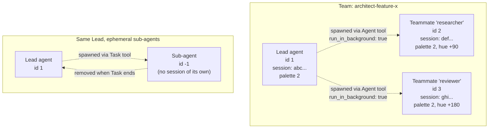

# Agent teams

Some AI coding CLIs let one agent spawn a *persistent* helper that lives across multiple turns. Claude's Agent Teams feature is the only example that ships today. Pixel Agents has a first-class concept for this: a **team** is a Lead and one or more **Teammates**, each rendered on the canvas as a full agent with its own character, seat, and lifecycle.

This page explains what teams are, how they differ from the ephemeral sub-agents you have probably already seen, and why the abstraction is opt-in at the provider level rather than baked into the server. The action steps for adding team support to a new provider live in [Build → Provider extensions](/build/providers/teamprovider-extension). The exhaustive interface reference lives in [Reference → TeamProvider](/reference/teamprovider).

## Vocabulary

Three terms are easy to confuse:

- **Team.** A named group, for example `architect-feature-x`. The team identifier is just a string the provider chooses. Claude uses the directory name under `~/.claude/teams/`.
- **Lead.** The originating session. The Lead is the one who calls TeamCreate (or whatever the provider's equivalent is) and decides who joins.
- **Teammate.** A persistent agent the Lead spawned via the provider's "background agent" mechanism. In Claude's case, the `Agent` tool with `run_in_background: true`. A teammate has its own session id, its own transcript, its own seat, and lives until it is explicitly removed or until the team is dissolved.

A fourth concept, the **sub-agent**, is *not* part of a team. It is ephemeral. Claude's `Task` tool spawns one. It lives only for the duration of the parent tool call. It does not persist between turns. Pixel Agents renders it as a negative-id character with the same skin as the parent (see the [CLAUDE.md condensed notes on sub-agents](/learn/the-office#sub-agents)).

The same Claude tool, `Agent`, can spawn either kind. The discriminator is `run_in_background: true` in the tool input. This is not something the server can guess; the provider has to tell it. That mechanism is the predicate `TeamProvider.isTeammateSpawnCall`.

## The predicate that everything hinges on

The single most important member of `TeamProvider` is `isTeammateSpawnCall(toolName, toolInput)` at `core/src/teamProvider.ts:31`. The interface documents the contract precisely:

> Authoritative predicate: does THIS SPECIFIC tool call spawn a persistent teammate? Depends on tool input flags, not just the tool name. Without this, we can't distinguish basic subagents from teammates when the same tool name is reused.
>
> Claude: `Agent` tool with `run_in_background: true`.

Why does this matter? Because the runtime treats the two cases very differently:

- For an ephemeral sub-agent (the `Task` tool, or the `Agent` tool *without* `run_in_background: true`), the runtime creates a temporary negative-id character that disappears when the parent tool ends.
- For a teammate (the `Agent` tool *with* `run_in_background: true`), the runtime expects a new transcript file to appear soon under the lead's session directory and prepares to adopt it as a full agent with a positive id.

If the predicate returns the wrong answer, you get either a ghost teammate that never materializes or an ephemeral sub-agent that never disappears. Both are bad and both are very confusing to debug.

The interface also surfaces `teammateSpawnTools` and `withinTurnSubagentTools` as `ReadonlySet<string>`. These are the *fast-path gate*: tool names that are *eligible* to spawn either kind of agent. The runtime uses them to short-circuit the expensive predicate call when the tool name is unrelated to spawning anything. For Claude:

- `teammateSpawnTools = new Set(['Agent'])`
- `withinTurnSubagentTools = new Set(['Task'])`

The two sets can overlap. `Agent` could appear in both if a future Claude allowed background sub-agents that are not full teammates. Today the predicate is enough to disambiguate.

## How discovery works

The Lead session has to know who its teammates are. The runtime asks the provider rather than reaching into Claude-specific files. The relevant methods on `TeamProvider`:

- `discoverTeammates(projectDir, leadSessionId)` returns the list of teammate transcripts already associated with this lead. The return shape is `Array<{ jsonlPath: string; teammateName: string }>`. The host hands `jsonlPath` back to its adoption code; `teammateName` identifies which member of the team it is.
- `getTeamMembers(teamName)` returns the current Set of member names, or `null` if the team can't be read (dissolved, never existed, file missing). This is the source of truth for team membership.

The implementations are provider-specific. For Claude, both methods read the filesystem:

- `getTeamMembers` reads `~/.claude/teams/<teamName>/config.json` and parses `members[].name` (verified at `server/src/providers/hook/claude/claudeTeamProvider.ts:115-126`).
- `discoverTeammates` scans the lead session's directory for subagent transcripts.

A future provider that stores team metadata over an HTTP API would implement the same two methods against that API. The runtime never sees the difference.

## How teammates appear in the office

Each teammate is a full first-class agent. From the canvas's perspective:

- It has its own positive integer id.
- It has its own seat assignment.
- It has its own character with its own palette and hue shift (typically inherited from the lead for visual continuity, but not required).
- It has its own activity status: it can be active, waiting, or showing permission dots.
- It can be selected, focused, and closed independently.

The webview learns about the team relationship via the `AgentTeamInfo` server message (one of the 26 variants in the [protocol](/learn/protocol)). The exact shape is in [Reference → Server messages](/reference/protocol/server-messages). The short version: it carries the `teamName`, the `leadAgentId`, and the `agentName` (teammate's name from the team config). The webview uses this to draw teammates differently if it wants to (a small badge, a different outline color, a visual line between Lead and Teammate, and so on).

The team box on the left and the sub-agent box on the right look superficially similar from outside the canvas. The runtime treats them as completely different shapes. Teammates are full rows in the `AgentStateStore`. Sub-agents are nested state inside the Lead's `AgentState` (`activeSubagentToolNames` and friends).

## Permission flows: Lead drives, Teammates listen

There is one place where the team relationship affects timing: permission prompts.

In single-agent setups, the heuristic permission timer fires 7 seconds after a non-exempt tool starts with no further activity (see [Hooks vs heuristic](/learn/hooks-vs-heuristic)). For teammates this would produce frequent false positives because tools running on a background agent can legitimately take longer than 7 seconds. The comment at `server/src/constants.ts:13-15` calls this out explicitly:

> Heuristic: time after a non-exempt tool starts before showing permission bubble. Not used for teammates, false positives on slow tools (WebFetch/WebSearch). Teammates rely on the lead's routed Notification(permission_prompt) hook.

The Lead is the only session Claude shows the permission prompt in. When that prompt appears, Claude fires a `Notification(permission_prompt)` hook with the relevant `agent_type` field. The provider's `extractTeammateNameFromEvent` (`core/src/teamProvider.ts:36`) reads `agent_type` and tells the runtime which teammate the prompt belongs to. The runtime then shows the dots over that specific teammate's character, not the Lead's.

The net result for the user: the Lead and Teammates all look like normal agents, but the permission dots show up on the right one without the Lead ever showing them by mistake.

## Why this is opt-in

The interface lives on `HookProvider.team` and is **optional**. Providers without team support simply don't set the field. The interface comment at `core/src/teamProvider.ts:10-12` makes this explicit:

> Providers without team support simply don't set `HookProvider.team`. No team-gated code runs for them, no stubs, no dead branches.

Three reasons this design choice was made:

1. **Most providers won't ever have teams.** A CLI that only supports single-shot interactions has no concept of background agents. Forcing every provider to stub out team methods would be noise.
2. **The team-gated code paths are non-trivial.** Subagent routing, teammate discovery, permission forwarding, removal when a member is dropped from the config. If a provider doesn't need any of it, none of it should run.
3. **The discriminator predicate has no sensible default.** A provider without `isTeammateSpawnCall` cannot answer the question "is this a sub-agent or a teammate?". A wrong answer breaks rendering. Refusing to even ask the question (by leaving `team` unset) is safer.

So the wiring is gated at the `HookProvider.team` field. The `HookEventHandler` checks the field once, at construction, and registers team-aware branches only when it is present (see `server/src/hookEventHandler.ts:84-91` for the merged subagent tool set logic). For a provider without `team`, the team handlers never get a chance to run.

## What this means for users

You don't have to know any of this to use Pixel Agents with Claude Agent Teams. The Lead and Teammates appear in the office. They sit at their own seats, animate when they work, and show permission prompts on the right character. If you're not using Agent Teams, you'll see ephemeral sub-agents (negative-id ghosts) on the canvas during `Task` tool calls and that is the only "agent inside an agent" you'll encounter.

## What this means for integrators

If you are writing a provider for a CLI that has a background-agent mechanism similar to Claude's:

1. Implement `TeamProvider` separately from `HookProvider`. Keep them in different files.
2. Set `HookProvider.team` to your `TeamProvider` instance.
3. Implement `isTeammateSpawnCall` with the predicate that distinguishes ephemeral spawns from persistent ones in your CLI's tool input shape.
4. Implement `discoverTeammates` against your CLI's storage (filesystem path, API endpoint, database, whatever it uses).
5. Implement `getTeamMembers` against the same source.
6. Implement `extractTeammateNameFromEvent` so the runtime can route permission and idle hooks to the right teammate character.

The [Build → Provider extensions](/build/providers/teamprovider-extension) page walks through each step.

If you are writing a provider for a CLI without background agents, just leave `HookProvider.team` undefined. The runtime will operate single-agent-only for your provider and that is a perfectly fine first version. You can add team support later when the CLI grows the feature.

## Where to go next

For the exhaustive interface reference (every method, every parameter, every return type), see [Reference → TeamProvider](/reference/teamprovider).

For the step-by-step recipe to add team support to a new provider, see [Build → Provider extensions](/build/providers/teamprovider-extension).

For how the AgentTeamInfo message wires through to the canvas, see [Reference → Server messages](/reference/protocol/server-messages) and look up the `AgentTeamInfo` variant.

For why the team handling lives in the provider rather than in the server, see [Decision 0001: Four-package split](/decisions/four-package-split). The short version: the server should know nothing about specific CLIs, and team semantics are deeply CLI-specific.
