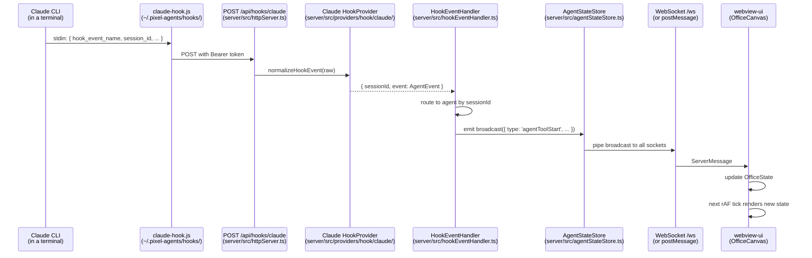
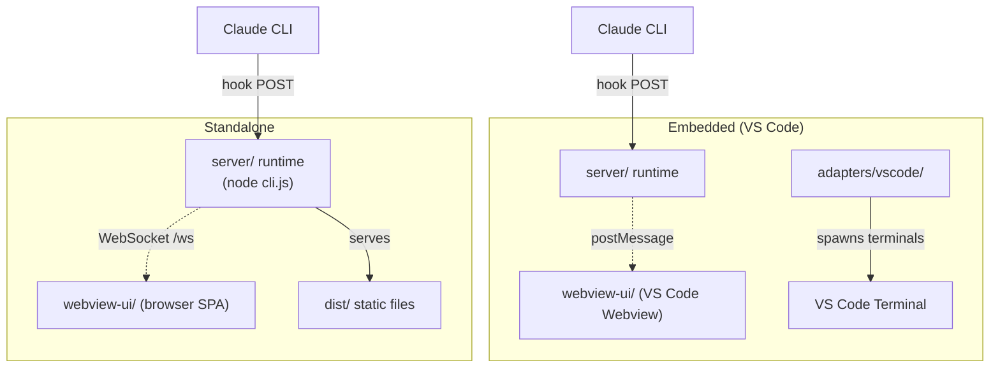

# Architecture

:::warning[AI-generated docs]
This document was AI-generated and may have some mistakes - we apologize for this, we're in the process of reviewing all documents. If you find any issues, we'd be thankful if you [submit an edit PR](https://github.com/pixel-agents-hq/docs/edit/main/docs/learn/architecture.md).
:::

Pixel Agents is intentionally split into four packages with sharp boundaries. Two of them have no runtime code at all. One owns all the lifecycle and state. The other two are integrations: one for hosts (today only VS Code), one for clients (today only the React canvas). This page walks through what each package owns, why, and how a hook event becomes a sprite move on the canvas.

If you only remember one thing: the **same server runtime** runs in both VS Code and standalone modes. The thing that changes is the transport (postMessage vs WebSocket) and where the assets live (VS Code asset URI vs `dist/`). Everything else is identical.

For the rationale behind this split, see [Decision 0001: Four-package split](/decisions/four-package-split). For the wire contract that makes it possible, see [the protocol page](/learn/protocol).

## The four packages

```mermaid
graph LR
  subgraph core[" core/ (types and contracts only) "]
    Schemas["schemas.ts<br/>(OfficeLayout, PersistedAgent, ...)"]
    Provider["provider.ts<br/>(AgentEvent, HookProvider)"]
    TeamProvider["teamProvider.ts<br/>(TeamProvider)"]
    Adapter["adapter.ts<br/>(StateAdapter)"]
    Messages["messages.ts<br/>(ServerMessage, ClientMessage)<br/>AUTO-GENERATED"]
    AsyncAPI["asyncapi.yaml<br/>(source of truth)"]
    AsyncAPI -.->|asyncapi:generate| Messages
  end

  subgraph server[" server/ (runtime) "]
    HttpServer["httpServer.ts<br/>(Fastify + WebSocket)"]
    Runtime["agentRuntime.ts<br/>(lifecycle core)"]
    Store["agentStateStore.ts<br/>(Map + events)"]
    Hooks["hookEventHandler.ts<br/>(event routing)"]
    Providers["providers/hook/claude/<br/>(bundled)"]
    CLI["cli.ts<br/>(standalone entry)"]
  end

  subgraph adapters[" adapters/ (host integrations) "]
    VsCode["vscode/<br/>(extension + webview provider)"]
  end

  subgraph ui[" webview-ui/ (React + canvas) "]
    React["React 19 + Vite"]
    Canvas["Canvas 2D renderer"]
    Editor["Layout editor"]
  end

  core --> server
  core --> adapters
  core --> ui
  server --> adapters
  server -.WebSocket / postMessage.-> ui
```

Arrows are import direction. `core/` depends on nothing. `server/` depends on `core/`. `adapters/` depends on `core/` and `server/`. `webview-ui/` depends on `core/` only (it talks to `server/` over the wire, not by import).

### core/: types and contracts

`core/` has no runtime behavior. Every export from `core/src/index.ts:4-27` is a `type` export or a constant. The package contains:

- **Provider interfaces.** `HookProvider` and `TeamProvider` describe what a CLI integration must implement, with no opinion on how. The base shape lives in `core/src/provider.ts:14-56` (the normalized `AgentEvent` union) and `core/src/provider.ts:60-128` (the `HookProvider` interface). `TeamProvider` is optional and lives in `core/src/teamProvider.ts`.
- **State adapter interface.** `StateAdapter` from `core/src/adapter.ts` lets adapters plug in their own persistence (VS Code workspace state, a JSON file on disk, etc.) without the server caring which.
- **Terminal adapter interface.** `ITerminalAdapter` from `core/src/terminalAdapter.ts` is the abstraction for launching an interactive shell. VS Code provides one, the standalone CLI does not need one.
- **Message transport interface.** `MessageTransport` from `core/src/transport.ts` is the abstraction over postMessage and WebSocket. Both sides write to the same shape.
- **The protocol.** `ServerMessage` and `ClientMessage` are the two discriminated unions in `core/src/messages.ts`. They are **auto-generated** from `core/asyncapi.yaml` and the file header at `core/src/messages.ts:1-8` says so explicitly: "DO NOT EDIT MANUALLY. Run `npm run asyncapi:generate` to regenerate."
- **Schemas.** `OfficeLayout`, `PersistedAgent`, `FurnitureCatalogEntry`, `AgentMeta`, and a handful more, all in `core/src/schemas.ts`.

The lack of runtime here is deliberate. A future Java client or a Python integration script consumes `core/asyncapi.yaml` directly and never depends on Node. The TypeScript artifact in `core/src/messages.ts` is a convenience for the rest of the monorepo.

### server/: runtime

`server/` is where everything happens. It is a Node.js package that runs identically in VS Code (started from the extension activation) and standalone (`node server/dist/cli.js`). The major pieces:

- **HTTP + WebSocket server.** `server/src/httpServer.ts` registers three routes on a Fastify instance: `GET /api/health`, `POST /api/hooks/:providerId`, and `GET /ws`. The hook endpoint requires a Bearer token. The WebSocket endpoint requires a Bearer token in embedded mode and skips auth in standalone mode (because it binds to `127.0.0.1` and only local processes can reach it). The auth decision is at `server/src/httpServer.ts:139-148`.
- **AgentRuntime.** `server/src/agentRuntime.ts` is the lifecycle core. It owns the per-agent timer maps (file watchers, polling timers, waiting timers, permission timers, JSONL poll timers), the dismissal tracker, and the wiring to the file scanners. Both the VS Code adapter and the standalone CLI instantiate one `AgentRuntime` and register platform-specific callbacks on it.
- **AgentStateStore.** `server/src/agentStateStore.ts` is the centralized owner of the `Map<number, AgentState>`. It emits typed events (`agentAdded`, `agentRemoved`, `agentUpdated`, `broadcast`) so the WebSocket layer can pipe state changes to clients without reaching into the runtime.
- **HookEventHandler.** `server/src/hookEventHandler.ts` is the dispatcher. It receives normalized `AgentEvent` instances from the provider, routes them to the right agent via the `SessionRouter`, sets `agent.hookDelivered = true` when delivery succeeds, and forwards to the right handler (tool start, tool done, permission, session end, and so on).
- **SessionRouter, DismissalTracker, FileStateAdapter, transcriptParser, timerManager, fileWatcher.** Supporting modules. The session router decides which session id belongs to which agent. The dismissal tracker remembers files the user closed so we don't re-adopt them. The file state adapter implements `StateAdapter` against a JSON file on disk (the standalone default).
- **Bundled providers.** `server/src/providers/hook/claude/` ships the only built-in `HookProvider`. The implementation, the team provider, and the hook installer live there. The hook script itself is bundled to standalone CJS by esbuild and written to `~/.pixel-agents/hooks/claude-hook.js`.
- **Standalone entry.** `server/src/cli.ts` is the binary entry. It binds 127.0.0.1 by default (configurable), serves the SPA from `dist/`, and optionally installs Claude hooks.

The boundary that matters: **`server/` knows about `core/` but knows nothing about VS Code**. Importing `vscode` from `server/` is a build error.

### adapters/: host integrations

`adapters/` is where integration with a specific host environment lives. Today the only adapter is `adapters/vscode/`:

- `extension.ts` is the entry point. It registers the webview view provider, wires the activation lifecycle, and shuts the runtime down on deactivate.
- `PixelAgentsViewProvider.ts` implements VS Code's `WebviewViewProvider`. It owns the embedded message transport (postMessage), forwards client messages into the server, and pipes server broadcasts back to the webview.
- `VscodeTerminalAdapter` implements `ITerminalAdapter` from `core/`. The server uses it to launch `claude --session-id <uuid>` in a real VS Code terminal.
- `migrateVsCodeState` migrates legacy workspace-state-only agent persistence into the new shared state shape.

A second adapter (JetBrains, Neovim, browser-only) would be a sibling directory with the same shape: an entry point, a transport implementation, a terminal adapter implementation if it has terminals, and a state adapter implementation if the host has its own persistence.

### webview-ui/: React SPA

`webview-ui/` is a React 19 + Vite app. It is the *client*, not the *server*. It does not import anything from `server/`. It imports types from `core/` only. It talks to the server over `MessageTransport`, which under the hood is either `vscode.postMessage` (embedded) or a WebSocket (standalone).

Major pieces inside `webview-ui/src/`:

- `office/engine/`: game state, character FSM, canvas renderer, matrix effect.
- `office/layout/`: layout serialization, BFS pathfinding, dynamic furniture catalog.
- `office/editor/`: pure layout operations, imperative editor state, toolbar UI.
- `office/sprites/`: sprite cache, character template data.
- `components/`, `hooks/`: React composition root and message handling.

The webview holds the entire office layout in memory (one `OfficeState` instance) and renders it imperatively at requestAnimationFrame rate. React is used for the chrome (toolbars, modals) but not the canvas itself, because game-tick state changes inside React would re-render the world 60 times a second.

## How a hook event becomes a sprite move

The data flow is straightforward once you know all four packages.

The steps in words. Claude is configured to run a hook script on every relevant event (`SessionStart`, `PreToolUse`, `PostToolUse`, `Stop`, and so on). The hook script reads the event from stdin, looks up the server URL and token in `~/.pixel-agents/server.json`, and POSTs to `/api/hooks/claude`. The server authenticates the request with the Bearer token, then hands the raw JSON to the Claude `HookProvider.normalizeHookEvent`. The provider returns either `null` (ignore) or a `{ sessionId, event: AgentEvent }` pair. The `HookEventHandler` finds the agent that owns that session id and, on the first successful delivery, flips `agent.hookDelivered = true` (suppressing the heuristic timers for that agent, see [Hooks vs heuristic](/learn/hooks-vs-heuristic)). It then maps the normalized `AgentEvent.kind` (`toolStart`, `toolEnd`, `turnEnd`, ...) to a `ServerMessage` variant, mutates the `AgentStateStore`, and the store emits a `broadcast` event. The WebSocket route listens for `broadcast` and forwards the message to every connected socket. The webview receives the message, updates the in-memory `OfficeState`, and the next animation frame renders the new state.

The transport is the only thing that changes between embedded and standalone. In VS Code, the same `ServerMessage` payload travels through `postMessage` instead of a WebSocket. The store, the handler, the provider, and the wire shape are identical.

## Embedded vs standalone modes

The same server code runs in both. The differences are deliberately small:

| Aspect | Embedded (VS Code) | Standalone |
|---|---|---|
| Entry | extension activate → `PixelAgentsViewProvider` constructs the server | `node server/dist/cli.js` (`server/src/cli.ts`) |
| Transport | `postMessage` via VS Code webview API | WebSocket on `/ws` |
| WebSocket auth | Bearer token required (`server/src/httpServer.ts:139-148`) | No auth (loopback bind) |
| Hook auth | Bearer token required | Bearer token required |
| SPA assets | Loaded via VS Code asset path | Served from `dist/` by Fastify static |
| Terminals | `VscodeTerminalAdapter` launches via VS Code API | No terminal adapter; user launches Claude manually or the CLI installs hooks for an existing Claude install |
| Multi-window | Second window detects existing `~/.pixel-agents/server.json` and reuses it | Single process per host |

The fact that "no auth in standalone" is acceptable comes from binding to `127.0.0.1`. Only processes on the same machine can connect. If you bind to a non-loopback interface (you can pass `--host 0.0.0.0`), you have removed the only thing protecting the socket and you should put a reverse proxy in front.

## Where to go next

For the deep dive on how state actually flows through the runtime (timer maps, dismissal tracker, session router, scanner intervals), read [Reference → State management](/reference/state-management). It is the lookup material that complements this page.

For the wire contract that all four packages agree on, read [Protocol](/learn/protocol) and then [Reference → Protocol overview](/reference/protocol/overview).

For the rationale behind the four-package split (why not a single package? why a TypeScript-only protocol?), read [Decision 0001: Four-package split](/decisions/four-package-split).

For the action steps to build a new provider, see [Build → Providers](/build/providers/overview). To build a new client, see [Build → Clients](/build/clients/overview). To build a new host adapter, see [Build → Adapters](/build/adapters/overview).
