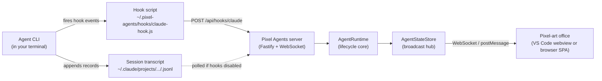

# How it works

One diagram, then a paragraph per arrow. By the end you'll have the mental model needed to navigate the rest of the docs.

## The five moving parts

### 1. The agent

You run an agent CLI (`claude` in these examples) in a terminal. It starts a session with a unique session ID. Everything the agent does (reading files, running commands, asking permission, completing a turn) emits two kinds of data: a hook event (synchronous, structured) and a JSONL transcript line (asynchronous, append-only).

### 2. The hook script

With hooks enabled (the default), Pixel Agents writes entries into the associated agent's settings (`~/.claude/settings.json` for instance) that tell the agent to run our script on every event of interest. The script is one bundled JavaScript file (`~/.pixel-agents/hooks/claude-hook.js`) that reads the event payload from stdin and POSTs it to the local Pixel Agents server with a Bearer token.

### 3. The JSONL transcript

Whether or not hooks are enabled, the agent also writes session activity to a JSONL file at `~/.claude/projects/<workspace-hash>/<session-id>.jsonl`. Each line is a JSON record describing a tool call, a tool result, a turn boundary, etc.

This is the fallback signal. When hooks aren't installed, Pixel Agents polls these files at 500ms intervals to reconstruct activity.

### 4. The server (runtime)

A Fastify HTTP + WebSocket server running locally on port 3100 (standalone) or an ephemeral port (VS Code embedded). It does three jobs:

- **Receive hook events** on `POST /api/hooks/claude`, normalize them via the active `HookProvider`, and dispatch to the right agent.
- **Watch JSONL files** as a fallback when hooks aren't delivering. Polling lives in the same module.
- **Broadcast state** over WebSocket (standalone) or postMessage (VS Code) to whatever UI is connected.

The runtime is the same in both contexts. The transport changes; the logic does not.

### 5. The office (UI)

A React + canvas SPA. Receives state updates from the server, owns the character finite-state machine (idle / walk / type / read), runs the rendering loop at requestAnimationFrame, and lets you edit the office layout.

The UI knows nothing about any specific agent or hooks or JSONL. It speaks the [AsyncAPI protocol](/learn/protocol). Any client that speaks the protocol gets the same experience.

## What happens when you click "+ Agent"

In VS Code:

1. The extension opens a new terminal.
2. The extension runs the agent inside it (`claude --session-id <uuid>`). The `<uuid>` is generated client-side so Pixel Agents knows exactly which session ID to watch for.
3. The extension polls the agent's transcript (`~/.claude/projects/<hash>/<uuid>.jsonl`) until the file appears.
4. As soon as the file appears, an agent is registered and a character spawns in the office.
5. Subsequent activity flows through whichever path is active (hooks or file watching).

In standalone, there's no "+ Agent" button (no IDE-managed terminal to spawn). Agents appear when you start one yourself in any terminal under the watched directory.

## What happens when the agent reads a file

With hooks enabled:

1. The agent fires a `PreToolUse` hook with `tool_name: 'Read'` and the file path.
2. Our hook script POSTs it to the server.
3. The active provider's `normalizeHookEvent` translates it to `AgentEvent { kind: 'toolStart', toolName: 'Read', input: {...} }`.
4. The runtime broadcasts `agentToolStart` over WebSocket / postMessage.
5. The UI shifts the character to the reading animation.

When the tool finishes, `PostToolUse` fires and the cycle reverses.

Without hooks, the same sequence is reconstructed from JSONL polling, with a ~500ms delay.

## What happens when the agent asks for permission

With hooks: a `PermissionRequest` or `Notification(permission_prompt)` hook fires immediately, the server broadcasts `agentToolPermission`, and the speech bubble appears within a frame.

Without hooks: a heuristic timer fires 7 seconds after a non-exempt tool starts. If the tool hasn't completed by then, the bubble appears. This is the source of occasional false positives on slow tools like `WebFetch`. It's why hooks are recommended and on by default.

See [Hooks vs heuristic](/learn/hooks-vs-heuristic) for the design rationale.

## Where state lives

- **Layout** (your office design): `~/.pixel-agents/layout.json`. Shared across VS Code and standalone.
- **Agents and seats** (per-host): `~/.pixel-agents/vscode-state.json` or `standalone-state.json`. Each host owns its own list.
- **Settings**: `~/.pixel-agents/config.json` with per-host sections.
- **Server discovery**: `~/.pixel-agents/server.json` (transient; written by whichever process owns the server).

The rationale for the per-host split is in [ADR-0005](/decisions/namespaced-persistence).

## The four-package code layout

If you're going to read the code, here's the map:

- `core/` - types and contracts only. No runtime.
- `server/` - the Fastify server, the AgentRuntime, the file watcher, the bundled Claude Code provider.
- `adapters/` - host integrations. Today: `adapters/vscode/`.
- `webview-ui/` - the React canvas SPA.

The boundaries are sharp and enforced by the import-direction rule. Details in [ADR-0001](/decisions/four-package-split) and the [architecture overview](/learn/architecture).

## Where to go next

- [Concepts](./concepts) - vocabulary you'll see in the docs.
- [The office](./the-office) - the UI in detail.
- [Agent lifecycle](./agent-lifecycle) - the lifecycle of a single agent.
- [Architecture](./architecture) - the four packages and how they talk.
- [Build extensions](/build) - if you want to add a new agent, alt UI, or new IDE host.
