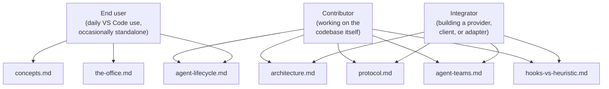

# Learn

Conceptual explanation of how Pixel Agents works. This section answers "why does it work this way?" rather than "how do I do X?". If you want a step-by-step recipe, head to [Use](/use/) for end-user guides or [Build](/build/) for integration surfaces. If you want a lookup of types, messages, or constants, jump to [Reference](/reference/cli).

The pages here are intentionally prose-heavy. They cite the relevant code at `file:line`, but the goal is for you to leave with a mental model, not a memorized API.

## Who these pages are for

Three rough audiences read this section, often for different reasons.

The end-user pages stay close to what you see on screen. The integrator pages explain the package boundaries, the wire contract, and the provider abstraction. Contributors will read everything, in roughly the order above.

## Pages in this section

### [Concepts](/learn/concepts)

The vocabulary every other page assumes. What is a terminal, a session, an agent, a teammate, a sub-agent, a seat, a tile, a provider. Short and read-once. Start here if you have never used Pixel Agents.

### [The office](/learn/the-office)

What the canvas actually represents. Characters, animations, seats, the FSM that decides whether a character is typing or walking, why the camera follows what it follows, how the matrix spawn effect ties to lifecycle events.

### [Agent lifecycle](/learn/agent-lifecycle)

The end-to-end path of one agent: the moment you click "+ Agent" in the toolbar, through the terminal launch, the hook handshake or first JSONL append, the seat assignment, the tool-by-tool animation, the eventual /clear or terminal close. The page makes explicit which signals come from where and how the runtime decides what to render next.

### [Architecture](/learn/architecture)

Pixel Agents is split into four packages: `core/` (types and contracts), `server/` (runtime), `adapters/` (host integrations such as VS Code), and `webview-ui/` (React canvas). This page explains the boundary of each package, how data flows from a Claude hook event through the runtime to the canvas, and how the same server runs in both embedded (VS Code) and standalone (browser SPA) modes.

### [Hooks vs heuristic](/learn/hooks-vs-heuristic)

There are two ways the server learns what an agent is doing: the Claude Code Hooks API (preferred), and file watching plus timers on the JSONL transcript (fallback). This page explains the trade-off, where the switch lives, and which heuristics are still active when hooks are working.

### [Agent teams](/learn/agent-teams)

The Lead and Teammates pattern. Why a teammate is a full first-class agent and a sub-agent is not, how the host discovers team members without the server hardcoding Claude-specific layout, and why the pattern is opt-in at the provider level.

### [Protocol](/learn/protocol)

Why there is an AsyncAPI document at the heart of the project. The single bidirectional WebSocket channel, the two discriminated unions of message types, the auto-generation pipeline that keeps the TypeScript types and the schema in sync, and what changes between embedded and standalone authorization.

## When to read what

If you just installed the extension and want to understand the picture on screen, read [Concepts](/learn/concepts) and [The office](/learn/the-office) and stop.

If you are about to write a new HookProvider for a CLI that is not Claude, read [Architecture](/learn/architecture), [Protocol](/learn/protocol), and [Hooks vs heuristic](/learn/hooks-vs-heuristic), then move to [Build → Providers](/build/providers/overview) for the action steps.

If you are about to write a third-party WebSocket client (a Discord bot, a web dashboard, a CLI status indicator), read [Protocol](/learn/protocol) and [Architecture](/learn/architecture), then move to [Reference → Protocol](/reference/protocol/overview) and [Build → Clients](/build/clients/overview).

If you are about to add a new host adapter (the VS Code adapter is the reference; a JetBrains or Neovim adapter would be next), read everything except [The office](/learn/the-office), then move to [Build → Adapters](/build/adapters/overview).

## What this section is not

Tutorials live under [Start](/start/what-is-pixel-agents). They walk you through your first agent end to end, the way a getting-started guide should.

How-to guides live under [Use](/use/) and [Build](/build/). They assume you already know the vocabulary and are trying to accomplish a specific thing.

Lookup tables, type signatures, message variants, and constants live under [Reference](/reference/cli). The Learn pages link out to Reference repeatedly, because explaining concepts works best when the exhaustive list lives elsewhere.

Decisions and their rationales live under [Decisions](/decisions/overview). When a Learn page says "this is the way it is because of X", the historical context for X lives there. Notably:

- [0001, Four-package split](/decisions/four-package-split) is the rationale behind the architecture page.
- [0002, AsyncAPI as protocol contract](/decisions/asyncapi-as-protocol-contract) is the rationale behind the protocol page.
