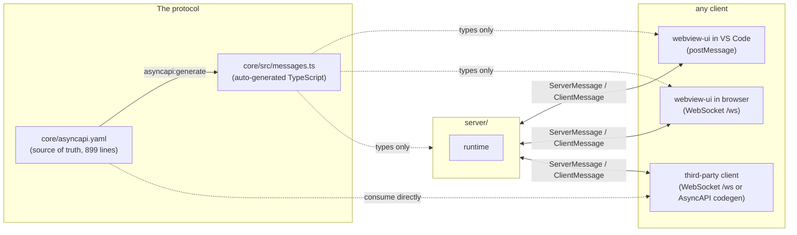

# Protocol

Pixel Agents has a single wire contract that every component agrees on. The VS Code adapter, the standalone CLI, the React canvas, and any future third-party client all read from and write to the same shape. That shape is declared in an AsyncAPI 3.0 document and the TypeScript types that the rest of the codebase uses are auto-generated from it.

This page explains why the contract exists at all, what it covers, how the generation pipeline works, and how authorization differs between embedded (VS Code) and standalone modes.

For the exhaustive message-by-message reference, see [Reference → Protocol overview](/reference/protocol/overview). For the rationale that led to picking AsyncAPI specifically, see [Decision 0002: AsyncAPI as protocol contract](/decisions/asyncapi-as-protocol-contract).

## Why a contract exists at all

When Pixel Agents was a single VS Code package, the message protocol was just a TypeScript union shared across two files in the same repo. Refactoring it was a single grep. There was no schema, no validation, no second consumer.

The [four-package split](/learn/architecture) changed that. The same message types now travel:

- From `server/` to `webview-ui/` over postMessage (embedded mode).
- From `server/` to `webview-ui/` over WebSocket (standalone mode).
- From `server/` to any future third-party client (a browser dashboard, a Discord bot, a status bar app, a Neovim plugin).
- Across version boundaries: an old VS Code adapter talking to a newer server, or vice versa.

In every one of those scenarios, *both ends* of the connection have to agree on the message shape. Without a contract, the agreement is implicit: each side reads the other's TypeScript and hopes nothing has drifted. With a contract, the agreement is explicit, machine-checked, and language-neutral.

The file that holds the contract is `core/asyncapi.yaml`, 899 lines describing every message variant, every field, every nested type. Every other place the protocol appears in the codebase is derived from this one file.

## The one channel

The protocol has exactly one channel: `/ws`. It is bidirectional and the server is allowed to push to a client at any time, not just in response to a request.

Two discriminated unions ride on top of that single channel:

- **`ServerMessage`** is everything the server can send to a client. 26 variants today, discriminated by the `type` field. The full list lives in `core/src/messages.ts:10-36` (auto-generated) and the source-of-truth list of `oneOf` refs lives in `core/asyncapi.yaml:78-115`.
- **`ClientMessage`** is everything a client can send to the server. 18 variants, same `type` discriminator. The list is at `core/src/messages.ts:38-56` and `core/asyncapi.yaml:117-137`.

Discriminator-based unions are the right choice here for two reasons. First, dispatch is fast: the handler reads one field and branches. Second, adding a new message variant is additive: existing clients ignore unknown `type` values gracefully, so the server can roll out new variants without breaking old clients (as long as those clients aren't *requiring* the new shape to work).



A Python or Java client that doesn't want to depend on TypeScript can run `asyncapi-codegen` against the YAML directly and get equivalent types in its own language. That option only works because the YAML is the source of truth, not the TypeScript.

## Why AsyncAPI 3.0 specifically

AsyncAPI is OpenAPI for async/event-driven APIs. It supports WebSockets, MQTT, Kafka, and a number of other transports. It has tooling around it for generating typed clients in multiple languages.

The header of `core/asyncapi.yaml:1-7` documents a deliberate version choice:

```yaml
# NOTE: pinned to 3.0.0 deliberately. @asyncapi/modelina v5.10.1 hardcodes
# `supportedVersions: ['3.0.0']` in its AsyncAPIInputProcessor. Bumping to
# 3.1.0 makes Modelina fall through to a generic JSON-schema parser that emits
# only `export type Root = any` instead of our 52 named interfaces. Bump when
# Modelina adds 3.1.0 support; the upgrade is `npx asyncapi convert` + a regen.
# `npm run asyncapi:validate` will keep emitting an info note recommending 3.1.0;
# that's expected and harmless until Modelina catches up.
```

The takeaway: the spec is on 3.0.0 because that is what our code generator (Modelina v5.10.1) understands. The AsyncAPI validator emits an info note recommending 3.1.0 every time it runs. That note is *expected and harmless*. The plan is to bump to 3.1.0 the day Modelina catches up; the upgrade is a one-line `npx asyncapi convert` plus a regeneration of `messages.ts`.

If you run `npm run asyncapi:validate` and see that info note, ignore it. It does not mean anything is broken.

## The generation pipeline

Three commands are wired up in `package.json` for the protocol:

| Command | What it does |
|---|---|
| `npm run asyncapi:validate` | Validates `core/asyncapi.yaml` against the AsyncAPI 3.0 spec. Emits the harmless 3.1.0 info note. |
| `npm run asyncapi:generate` | Runs Modelina against the YAML and writes `core/src/messages.ts`. |
| `npm run build` | Runs everything. Validation, generation, then the normal compile + lint + bundle. |

The auto-generated `core/src/messages.ts` declares both top-level unions and every interface they're built from. The file header at `core/src/messages.ts:1-8` is explicit:

```ts
/**
 * AUTO-GENERATED FROM core/asyncapi.yaml. DO NOT EDIT MANUALLY.
 *
 * Run `npm run asyncapi:generate` to regenerate.
 *
 * Source of truth: the yaml at core/asyncapi.yaml.
 * Editors and clients in any language can consume the spec directly.
 */
```

If you find yourself wanting to edit `messages.ts` directly, stop. The next generation will overwrite your edits. Edit the YAML, run the generator, commit both.

## Provider-agnostic by design

A subtle but important property: the protocol is **provider-agnostic**. Nothing in `ServerMessage` or `ClientMessage` mentions Claude, the JSONL format, the hooks API, or any other Claude-specific concept. The names are domain names: `agentToolStart`, `agentStatus`, `permissionRequest`, `subagentClear`.

The translation from raw Claude events to these domain messages happens inside `HookProvider`. The interface at `core/src/provider.ts:14-56` declares the normalized `AgentEvent` shape, and `core/src/provider.ts:73-76` declares the `normalizeHookEvent` method that providers implement:

```ts
/** Normalize a raw hook event payload into an AgentEvent.
 *  Each CLI sends different JSON (Claude: snake_case, Copilot: camelCase, etc.)
 *  The provider translates to the common AgentEvent format.
 *  Return null for events we should ignore. */
normalizeHookEvent(raw: Record<string, unknown>): {
  sessionId: string;
  event: AgentEvent;
} | null;
```

The flow: a CLI's raw event arrives at the hook endpoint, the provider normalizes it to `AgentEvent`, the server's `HookEventHandler` runs the normalized event through its (provider-agnostic) state machine, and the resulting changes broadcast as `ServerMessage`s. By the time the message hits the wire, every trace of "which CLI did this come from?" has been abstracted away.

This is what makes the protocol stable across future providers. A Copilot hook provider would translate `camelCase` events to the same `AgentEvent` shape. The webview never knows the difference. Adding a provider does not change the protocol.

## Embedded vs standalone authorization

The same message shape rides on two different transports with two different authorization stances.

**Hooks** always require authentication. The hook endpoint (`POST /api/hooks/:providerId`) requires a Bearer token regardless of mode. The hook script reads the token from `~/.pixel-agents/server.json` and includes it on every POST. Anyone who can read that file can authenticate. The file's mode bits are the protection. This applies in both VS Code and standalone mode.

**WebSocket connections** are where the modes diverge. The relevant check lives at `server/src/httpServer.ts:139-148`:

```ts
// In standalone mode (not embedded), skip auth for WebSocket connections.
// The server binds to 127.0.0.1, so only local clients can connect.
// In embedded mode (VS Code), require Bearer token for security.
if (options.embedded) {
  const auth = request.headers.authorization ?? '';
  const expected = `Bearer ${options.token}`;
  const authBuf = Buffer.from(auth);
  const expectedBuf = Buffer.from(expected);
  if (authBuf.length !== expectedBuf.length || !crypto.timingSafeEqual(authBuf, expectedBuf)) {
    socket.close(4001, 'unauthorized');
    return;
  }
}
```

The standalone case omits the token check because the server binds to `127.0.0.1`. The kernel rejects any non-local connection attempt. Only processes on the same machine, with permission to open a loopback socket, can reach the WebSocket at all. Adding a Bearer token on top of loopback doesn't buy security; it just adds a friction step that breaks third-party clients (which would have to scrape `server.json` for the token in the same way).

The embedded case keeps the Bearer requirement because the webview's communication channel is `postMessage` and the WebSocket is *not normally used at all*. If the WebSocket *is* opened in embedded mode (debug tools, an experimental external integration), the token check ensures only callers that already have access to the workspace's secrets can connect. The constant-time `crypto.timingSafeEqual` comparison prevents trivial timing attacks on the token compare.

The two modes share the same code path. Only the `if (options.embedded)` branch differs. Everything else, including the broadcast pipeline, the message shape, the discriminator, is identical.

## What this means for clients

If you are building a third-party client (a Discord bot, a browser dashboard, a CLI status indicator):

- You can consume `core/asyncapi.yaml` directly with any AsyncAPI-aware codegen tool to get types in your language.
- Or, if you're in TypeScript, you can depend on `core/` and import `ServerMessage` / `ClientMessage` directly.
- Connect to `ws://127.0.0.1:<port>/ws` after reading port from `~/.pixel-agents/server.json`. No auth required in standalone mode.
- Handle every variant of `ServerMessage` you care about; ignore variants you don't (the `type` field tells you which is which).
- Send only valid `ClientMessage` variants; unknown types will be dropped by the server.

The [Build → Clients](/build/clients/overview) page has the full how-to with code examples.

## What this means for adapters

If you are building a new host adapter (JetBrains, Neovim, browser-only):

- Implement `MessageTransport` from `core/src/transport.ts` for your host's IPC mechanism. If your host has nothing like postMessage, use a WebSocket loopback.
- Wire `ClientMessage` send and `ServerMessage` receive through that transport.
- Decide whether your adapter wants the Bearer token model (embedded-style) or loopback-only (standalone-style). The former is the safer default for adapters that run inside an editor with extensions from third parties; the latter is fine for tightly controlled hosts.

The [Build → Adapters](/build/adapters/overview) page has the action steps.

## Where to go next

For the lookup material:

- [Reference → Protocol overview](/reference/protocol/overview) lists every message variant in both unions.
- [Reference → Server messages](/reference/protocol/server-messages) and [client messages](/reference/protocol/client-messages) have per-variant details.

For the rationale:

- [Decision 0002: AsyncAPI as protocol contract](/decisions/asyncapi-as-protocol-contract) explains why we picked AsyncAPI over alternatives (Protobuf, JSON Schema, hand-written TS unions).

For building against the protocol:

- [Build → Clients overview](/build/clients/overview) for third-party clients.
- [Build → Adapters overview](/build/adapters/overview) for new host integrations.
- [Build → Providers overview](/build/providers/overview) for new CLI integrations.
