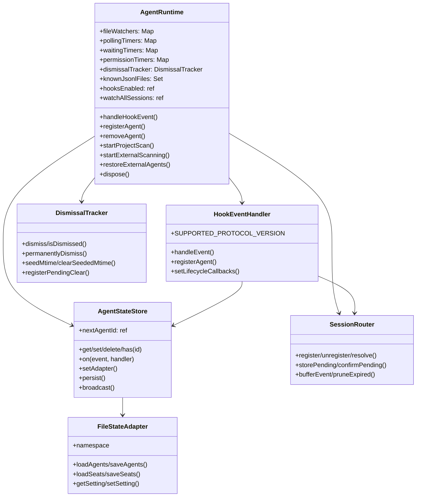

# State Management Reference

:::warning[AI-generated docs]
This document was AI-generated and may have some mistakes - we apologize for this, we're in the process of reviewing all documents. If you find any issues, we'd be thankful if you [submit an edit PR](https://github.com/pixel-agents-hq/docs/edit/main/docs/reference/state-management.md).
:::

The server tier owns all agent state and lifecycle. Five classes carry the load: `AgentRuntime`, `AgentStateStore`, `SessionRouter`, `DismissalTracker`, `FileStateAdapter`. `HookEventHandler` ties them together. This page documents the public surface of each.

For the why behind the centralization, see [ADR-0004 AgentRuntime](/decisions/agentruntime-as-shared-lifecycle-core) and [ADR-0005 Namespaced persistence](/decisions/namespaced-persistence).

## Class relationships



---

## AgentRuntime

**File:** `server/src/agentRuntime.ts:48-436`.

Single owner of agent lifecycle. Both the VS Code adapter and the standalone CLI construct one and register platform-specific callbacks.

### Construction

```ts
constructor(
  private readonly store: AgentStateStore,
  provider: HookProvider,
)
```

The constructor (lines 72-177):

1. Wires module-level dependencies (`setDismissalTracker`, `setHookProvider`, `setFileWatcherHookProvider`, `setTeamProvider`, `setAgentRemovalCallback`, `setTeammateRemovalCallback`).
2. Instantiates `HookEventHandler` with the store, waiting/permission timer Maps, the provider, a new `SessionRouter`, and the `watchAllSessions` ref.
3. Registers six lifecycle callbacks with the hook handler: `onExternalSessionDetected`, `onSessionClear`, `onSessionResume`, `onTeammateDetected`, `onTeammateRemoved`, `onSessionEnd`.

### Fields

| Field | Type | Purpose |
|---|---|---|
| `fileWatchers` | `Map<number, fs.FSWatcher>` | Per-agent native file watchers. |
| `pollingTimers` | `Map<number, setInterval>` | Per-agent polling fallback (Windows + macOS APFS edge cases). |
| `waitingTimers` | `Map<number, setTimeout>` | Pending "agent is waiting" status promotion timers. |
| `permissionTimers` | `Map<number, setTimeout>` | Pending permission-bubble timers (heuristic mode). |
| `jsonlPollTimers` | `Map<number, setInterval>` | JSONL line-polling fallback. |
| `knownJsonlFiles` | `Set<string>` | All transcript paths the runtime is tracking. |
| `projectScanTimer` | `{ current }` ref | Project-level scanner handle. |
| `activeAgentId` | `{ current }` ref | Most recently focused agent (for terminal adoption). |
| `watchAllSessions` | `{ current: boolean }` ref | "Watch All Sessions" toggle, shared with scanners. |
| `hooksEnabled` | `{ current: boolean }` ref | Hooks toggle, shared with scanners. |
| `dismissalTracker` | `DismissalTracker` | File-dismissal state. |

### Methods

#### handleHookEvent(providerId: string, event: Record\<string, unknown>): void

Route an incoming hook event to the hook handler. Called by the HTTP route in `server/src/cli.ts:93-95` and by the VS Code adapter's equivalent wiring.

#### registerAgent(sessionId: string, agentId: number): void

Register a session→agent mapping. Flushes any buffered events for this session.

#### unregisterAgent(sessionId: string): void

Remove a session mapping (called on agent removal / terminal close).

#### removeAgent(id: number): void

Tear down an agent: stop JSONL poll timer, close file watcher, cancel waiting + permission timers, fire `onAgentRemoved` to the adapter, delete from store, persist.

```ts
// server/src/agentRuntime.ts:204-234
removeAgent(id: number): void {
  const agent = this.store.get(id);
  if (!agent) return;
  const jpTimer = this.jsonlPollTimers.get(id);
  if (jpTimer) clearInterval(jpTimer);
  this.jsonlPollTimers.delete(id);
  this.fileWatchers.get(id)?.close();
  this.fileWatchers.delete(id);
  // ... etc
  this.lifecycleCallbacks.onAgentRemoved?.(id, agent);
  this.store.delete(id);
  this.store.persist();
}
```

#### removeTeammate(teammateId: number, source: string): void

Remove a single teammate. Dismisses the JSONL file (so it isn't re-adopted), unregisters the session, fires the adapter callback, and removes the agent.

#### removeTeammates(leadId: number): void

Remove all teammates whose `leadAgentId === leadId`. Called when the lead agent is closed.

#### startProjectScan(projectDir, onAgentCreated?)

Start project-level scanning for a directory. Delegates to `ensureProjectScan` in `fileWatcher.ts`.

#### startExternalScanning(projectDir)

Start external session scanning (detects sessions from other terminals). Idempotent: `if (this.externalScanTimer) return;`.

#### startStaleCheck()

Start the 30-second stale check that removes external agents whose JSONL files no longer exist. Idempotent.

#### restoreExternalAgents()

On standalone startup, recreate external agents from the adapter's `loadAgents()` snapshot. Only external agents are restorable (no terminal to rebind). VS Code does its own restore in `agentManager.ts`.

#### dispose()

Tear down everything: hook handler, three scanners (project/external/stale), and every agent via `removeAgent`. Called on shutdown (`server/src/cli.ts:156-160`).

### Lifecycle callbacks

The adapter registers `RuntimeLifecycleCallbacks` via `setLifecycleCallbacks(callbacks)`:

```ts
// server/src/agentRuntime.ts:41-46
export interface RuntimeLifecycleCallbacks {
  onAgentRemoved?: (agentId: number, agent: AgentState) => void;
  onTeammateRemoved?: (teammateId: number, agent: AgentState, source: string) => void;
}
```

VS Code uses these to dismiss its own JSONL bookkeeping. Standalone leaves them unset.

---

## AgentStateStore

**File:** `server/src/agentStateStore.ts:19-149`.

Map-compatible wrapper around `Map<number, AgentState>` with a typed event emitter for reactive UI broadcasting.

### Construction

```ts
new AgentStateStore();
```

No arguments. Owns its own `Map` and `EventEmitter`. The adapter is set later via `setAdapter()`.

### Fields

| Field | Type | Purpose |
|---|---|---|
| `nextAgentId` | `{ current: 1 }` ref | Monotonic ID generator. Shared mutably with scanners. |
| `nextTerminalIndex` | `{ current: 1 }` ref | Terminal index generator. |

### Map-compatible methods

`get(id)`, `has(id)`, `size`, `keys()`, `values()`, `entries()`, `forEach(cb, thisArg?)`, `[Symbol.iterator]()`, `set(id, agent)`, `delete(id)`, `clear()`.

### Event subscription

```ts
// server/src/agentStateStore.ts:7-12
export interface StoreEvents {
  agentAdded: (id: number, agent: AgentState) => void;
  agentRemoved: (id: number) => void;
  agentUpdated: (id: number, agent: AgentState, field: string) => void;
  broadcast: (message: Record<string, unknown>) => void;
}

store.on('agentAdded', (id, agent) => { /* ... */ });
store.on('broadcast', (msg) => { /* send over WebSocket */ });
```

`set(id, agent)` emits `agentAdded` on new IDs. `delete(id)` emits `agentRemoved`. `broadcast(msg)` emits `broadcast`.

### Broadcast

```ts
broadcast(message: Record<string, unknown>): void
```

Emits a `broadcast` event. WebSocket clients receive these via the listener registered in `server/src/httpServer.ts:171-177`.

### Persistence

```ts
setAdapter(adapter: StateAdapter): void
getAdapter(): StateAdapter | undefined

persist(): void  // snapshot to adapter.saveAgents()
loadPersistedAgents(): PersistedAgent[]
```

`persist()` builds a `PersistedAgent[]` from the in-memory map and calls `adapter.saveAgents()`. Silent no-op if no adapter is set.

---

## SessionRouter

**File:** `server/src/sessionRouter.ts:25-120`.

Owns three concerns previously tangled into `HookEventHandler`:

1. **Session→agent ID mapping** (the main lookup).
2. **Pending external sessions** (sessions detected via `SessionStart` but not yet confirmed by an agent registration).
3. **Event buffering** (events arriving before an agent has registered).

### Buffering

When an event arrives for an unknown sessionId, it's buffered with a timestamp:

```ts
bufferEvent(providerId: string, event: { session_id: string; ... }): void
```

A periodic timer prunes expired entries (`HOOK_EVENT_BUFFER_MS = 5_000` from `server/src/constants.ts:49`). When `register(sessionId, agentId)` is called, all matching buffered events are returned and the caller re-dispatches them.

### Methods

| Method | Purpose |
|---|---|
| `register(sessionId, agentId)` | Map a session to an agent. Returns buffered events for this session. |
| `unregister(sessionId)` | Remove a session mapping. |
| `resolve(sessionId)` | Return the agent ID or `undefined`. |
| `hasSession(sessionId)` | Boolean check. |
| `storePending(sessionId, info)` | Record a pending external session. |
| `confirmPending(sessionId)` | Pop a pending entry. |
| `hasPending(sessionId)` | Boolean check. |
| `discardPending(sessionId)` | Forget a pending entry without confirming. |
| `bufferEvent(providerId, event)` | Buffer an event for later flush. |
| `hasBuffered(sessionId)` | Boolean check. |
| `pruneExpired()` | Remove entries older than `HOOK_EVENT_BUFFER_MS`. |
| `dispose()` | Clear all maps + stop the prune timer. |

---

## DismissalTracker

**File:** `server/src/dismissalTracker.ts:10-101`.

Four state buckets for JSONL file dismissal logic. Replaces four scattered module-global Maps that used to live in `fileWatcher.ts`.

### Buckets

| Bucket | Purpose | Lifetime |
|---|---|---|
| `dismissed` | User-closed (X button). | `DISMISSED_COOLDOWN_MS = 180_000` (3 minutes). |
| `permanent` | `/clear` reassigned. Never re-adopt in this session. | Process lifetime. |
| `seeded` | Mtime at startup. If actual mtime changes later, session was `--resume`d. | Process lifetime. |
| `pending` | `/clear` files waiting for a second scan tick before adoption. | Until cleared or first scan picks them up. |

### Methods

```ts
// Temporary dismissals
dismiss(path, timestamp?)         // Set with optional timestamp (for testing)
clearDismissal(path)              // Explicit clear (on --resume)
isDismissed(path)                 // True if within cooldown; auto-cleans expired

// Permanent dismissals
permanentlyDismiss(path)
isPermanentlyDismissed(path)

// Seeded mtimes
seedMtime(path, mtime)
getSeededMtime(path)
clearSeededMtime(path)
hasSeededMtime(path)

// Pending /clear
registerPendingClear(path, timestamp?)
hasPendingClear(path)
clearPendingClear(path)

// Reset (tests + dispose)
resetAll()
```

The cooldown logic auto-cleans expired entries:

```ts
// server/src/dismissalTracker.ts:40-47
isDismissed(path: string): boolean {
  const timestamp = this.dismissed.get(path);
  if (timestamp === undefined) return false;
  if (Date.now() - timestamp < DISMISSED_COOLDOWN_MS) return true;
  this.dismissed.delete(path);
  return false;
}
```

---

## FileStateAdapter

**File:** `server/src/fileStateAdapter.ts:45-134`.

The bundled `StateAdapter` implementation. Persists agents, seats, and settings to `~/.pixel-agents/`.

### Construction

```ts
new FileStateAdapter({ namespace: 'vscode' });
new FileStateAdapter({ namespace: 'standalone' });
```

`ConfigNamespace = 'vscode' | 'standalone'` today. New hosts add their own.

### Files written

| File | Owner |
|---|---|
| `~/.pixel-agents/<namespace>-state.json` | Per-namespace agents + seats. |
| `~/.pixel-agents/config.json` | Shared, with per-namespace sections. |

### Methods

```ts
// Per-namespace agents + seats
loadAgents(): PersistedAgent[]
saveAgents(agents: PersistedAgent[]): void
loadSeats(): Record<string, { palette?; hueShift?; seatId? }>
saveSeats(seats): void

// Shared settings, per-namespace section
getSetting<T>(key: string, defaultValue: T): T
setSetting<T>(key: string, value: T): void
```

Settings keys are stripped of the `pixel-agents.` prefix before being routed to the namespace section (`server/src/fileStateAdapter.ts:60-74`):

```ts
function settingNameOf(key: string): AdapterSettingKey | null {
  const bare = key.startsWith('pixel-agents.') ? key.slice('pixel-agents.'.length) : key;
  return ADAPTER_SETTING_KEY_SET.has(bare) ? (bare as AdapterSettingKey) : null;
}
```

Unknown keys are ignored. Today's known keys: `soundEnabled`, `lastSeenVersion`, `alwaysShowLabels`, `watchAllSessions`, `hooksEnabled`, `hooksInfoShown` (see `server/src/configPersistence.ts:ADAPTER_SETTING_KEYS`).

### Atomic writes

State files are written tmp+rename for crash-safety:

```ts
// server/src/fileStateAdapter.ts:121-132
const tmpPath = this.stateFilePath + '.tmp';
fs.writeFileSync(tmpPath, json, 'utf-8');
fs.renameSync(tmpPath, this.stateFilePath);
```

---

## HookEventHandler

**File:** `server/src/hookEventHandler.ts:58-`.

Receives normalized `AgentEvent`s from the active `HookProvider`, dispatches by session ID. The protocol version gate at line 62 rejects events from providers whose version it does not understand.

### Construction

```ts
new HookEventHandler(
  store: AgentStateStore,
  waitingTimers: Map<number, setTimeout>,
  permissionTimers: Map<number, setTimeout>,
  provider: HookProvider,
  sessionRouter: SessionRouter,
  watchAllSessionsRef?: { current: boolean },
)
```

### Protocol version gate

```ts
private static readonly SUPPORTED_PROTOCOL_VERSION = 1;
```

A provider declaring a different `protocolVersion` is logged once at construction (line 72-78) and all subsequent events are dropped silently (line 132-134). Bumping this constant is the formal way to break the `AgentEvent` shape.

### Effect on hookDelivered

When a hook event is successfully dispatched to a known agent, the handler sets `agent.hookDelivered = true`. This flag suppresses the heuristic permission and text-idle timers in `timerManager.ts` (constants `PERMISSION_TIMER_DELAY_MS = 7000` and `TEXT_IDLE_DELAY_MS = 5000` at `server/src/constants.ts:13-17`). See [Hooks vs heuristic](/learn/hooks-vs-heuristic) for the design rationale.

### Lifecycle callbacks

```ts
setLifecycleCallbacks({
  onExternalSessionDetected,
  onSessionClear,
  onSessionResume,
  onTeammateDetected,
  onTeammateRemoved,
  onSessionEnd,
})
```

`AgentRuntime` registers all six (`server/src/agentRuntime.ts:96-176`) to route events into shared agent operations.

---

## Related

- [AgentEvent reference](./protocol/agent-events)
- [HookProvider reference](./hookprovider)
- [Hooks coverage](./hooks-coverage)
- [Errors reference](./errors)
- [Architecture overview](/learn/architecture)
- [ADR-0004 AgentRuntime](/decisions/agentruntime-as-shared-lifecycle-core)
- [ADR-0005 Namespaced persistence](/decisions/namespaced-persistence)
