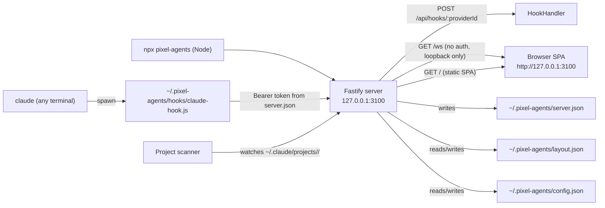

# Standalone overview

Pixel Agents without VS Code. A local server serves a browser SPA that
visualizes your Claude sessions.

This page is the feature tour. Once you've decided you want standalone mode,
read [Running the server](./running-the-server) for flags, ports, and disk
state. If something doesn't work, head to
[Troubleshooting](./troubleshooting).

## What it does

`npx pixel-agents` does four things in one process:

1. Starts a Fastify HTTP server on a local port (default `3100`,
   loopback only).
2. Serves the React SPA out of the bundled `dist/webview/` directory.
3. Scans the directory you launched from for active Claude sessions in
   `~/.claude/projects/<current-cwd-hash>/`.
4. Optionally installs Claude hooks into `~/.claude/settings.json` so events
   from your Claude sessions are pushed to the server in real time.

The browser tab is just a thin client. The server is the source of truth for
agent state, settings, and the layout file. If you close the browser, the
server keeps running. If you reopen the page, the server tells the new tab
everything it knows. If you Ctrl+C the server, everything goes away.

## Quick start

From any directory you'd like to watch:

```sh
npx pixel-agents
```

You'll see something close to this in the terminal:

```text
[Pixel Agents] Loading assets...
[Pixel Agents] Assets loaded: 6 characters, 87 furniture items
[Pixel Agents] Hooks installed
[Pixel Agents] Scanning project dir: /Users/you/.claude/projects/-Users-you-code-myproject
[Pixel Agents] Server: listening on 127.0.0.1:3100

  Pixel Agents server running at http://127.0.0.1:3100
```

Open `http://127.0.0.1:3100/` in any modern browser. The office appears.

To stop: Ctrl+C in the terminal. The server prints `Shutting down...` and
cleans up its discovery file.

## Discovery and multi-window

Each `npx pixel-agents` invocation writes a discovery file at
`~/.pixel-agents/server.json` with the port, PID, and an auth token. This is
the same file hook scripts read to find the server, and it's the same file a
second `npx pixel-agents` invocation reads to detect that a server is already
running.

If a second invocation finds a running server (PID alive), it reuses it
instead of starting a new one. From `server/src/server.ts:66-75`:

```ts
const existing = this.readServerJson();
if (existing && isProcessRunning(existing.pid)) {
  this.config = existing;
  this.ownsServer = false;
  console.log(
    `[Pixel Agents] Reusing existing server on port ${existing.port} (PID ${existing.pid})`,
  );
  return existing;
}
```

`isProcessRunning` uses `process.kill(pid, 0)` to test liveness without
actually killing anything (`server/src/server.ts:173-181`). This makes
multi-window safe: opening two terminals and running `npx pixel-agents` in
both just gives you one server with the second invocation logging "Reusing
existing server".

Stopping the second invocation (Ctrl+C in that second terminal) does not
delete `server.json`. Only the owning process can delete the discovery file
(`server/src/server.ts:159-170`).

## Capabilities today

The standalone build ships with these features:

- **Real-time agent visualization.** The canvas, character FSM, animation,
  speech bubbles, sub-agents, teammates, and pathfinding are identical to
  the VS Code extension. The two run the exact same webview bundle.
- **Hook installation for instant detection.** Hooks are installed
  automatically on startup if the `hooksEnabled` setting is on, which it is
  by default. See `server/src/cli.ts:128, 132-140`.
- **Layout editor.** Paint floor and walls, place furniture, rotate, undo,
  redo, save. The layout is stored in `~/.pixel-agents/layout.json` and is
  shared with any VS Code window watching the same file.
- **External agent adoption.** If Claude is already running in some other
  terminal (outside of `npx pixel-agents`), the scanner notices the JSONL
  file and adopts it as an external agent.
- **Watch All Sessions toggle.** Off by default. When on, the scanner
  walks every project under `~/.claude/projects/` rather than just the
  directory you launched from. Useful if you want a single browser window
  that watches every Claude session on the machine.
- **Settings panel.** Sound notifications, "always show labels", "watch all
  sessions", "hooks enabled", external asset directories. Settings persist
  in `~/.pixel-agents/config.json` under the `standalone` namespace
  (`server/src/cli.ts:80-83`).

## Current gaps vs VS Code

A few things the VS Code extension can do that standalone can't yet:

- **No `+ Agent` button.** The standalone server has no way to spawn a new
  terminal in your shell. The webview's spawn UI is hidden when the client
  is connected to standalone. From `server/src/clientMessageHandler.ts:125-128`:

  > `focusAgent, exportLayout, importLayout` require IDE-specific handling
  > (not yet implemented for standalone).

  Workaround: open a terminal yourself, run `claude` (or `claude --session-id
  <uuid>`), and the scanner adopts the session as an external agent.

- **No `focusAgent` action.** Clicking a character in VS Code switches the
  active terminal to that agent's terminal. In standalone there is no
  terminal to focus, so the click is a no-op (selection still works).

- **No `exportLayout` / `importLayout`.** The VS Code commands open native
  save/open dialogs through the VS Code API. Browsers don't have the same
  affordance. Layout files can still be moved manually by copying
  `~/.pixel-agents/layout.json` to or from another machine. A
  download/upload button is a likely future addition but not implemented
  today.

- **Multi-root workspaces are an IDE concept.** VS Code surfaces multi-root
  folders to the webview via `workspaceFolders`. Standalone has no notion
  of a "workspace" because it has no IDE.

If you bump into one of these, you can still mix-and-match: run `npx
pixel-agents` for the office on one screen and use VS Code on another. Both
read the same `~/.pixel-agents/layout.json` so layout edits propagate.

## System requirements

- **Node.js**: 18 or newer. The CLI is published as an ESM/CJS hybrid bundle
  and uses standard Node 18 APIs. Check your version with `node -v`.
- **OS**: macOS, Linux, Windows. Tested most heavily on Windows 11; macOS
  and Linux are supported but may show subtle file-watching differences.
- **Browser**: any modern release (Chrome, Firefox, Safari, Edge). The SPA
  uses Canvas 2D, the Web Audio API, and standard WebSocket.

## Architecture in one diagram



## Where to go next

- Flags, ports, host binding, multi-window: [Running the server](./running-the-server).
- Symptoms and fixes: [Troubleshooting](./troubleshooting).
- The underlying architecture (Provider, Adapter, Runtime, Client):
  [/learn/architecture.md](../../learn/architecture).
- Building your own client (or a non-browser viewer):
  [/build/clients/overview.md](../../build/clients/overview).
